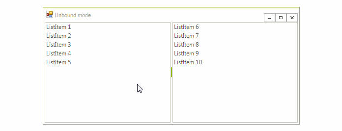

# ListControlDragDropService

Since *R1 2017 SP* **RadListControl** supports **ListControlDragDropService**. It is necessary to set the **AllowDragDrop** property to *true* in order to enable its functionality. The benefits that come with this service are:

* Items drag and drop behavior in unbound mode comes out of the box within the same **RadListControl** or between two **RadListControls**.

* **ListControlDragDropService** allows you to achieve drag and drop behavior in bound mode through its public API.

## Drag and drop in unbound mode out of the box

The following steps demonstrates how to populate two **RadListControls** with items in unbound mode and enable the drag and drop functionality between them.

1\. Add two **RadListControls** on your form and add some items via the *RadListDataItem Collection Editor*. 
2\. Set the **AllowDragDrop** property to *true* for both of the **RadListControls** either at design time in the *Properties* section of Visual Studio or via code at run time.
3\. Run the application and try to reorder the items.

>caption Figure 1: Drag and drop in unbound mode



## Drag and drop in bound mode by using ListControlDragDropService

1\. Consider that you have two **RadListControls** which are bound to a **BindingList** of custom *Item* objects. 

{{source=..\SamplesCS\DropDownListControl\ListControl\ListControlBoundDragDrop.cs region=BoundListControl}} 
{{source=..\SamplesVB\DropDownListControl\ListControl\ListControlBoundDragDrop.vb region=BoundListControl}} 

````C#
        
public ListControlBoundDragDrop()
{
    InitializeComponent();
    BindingList<Item> items = new BindingList<Item>();
    BindingList<Item> items2 = new BindingList<Item>();
    for (int i = 0; i < 20; i++)
    {
        items.Add(new Item(i, "Item.1." + i));
        items2.Add(new Item(i, "Item.2." + i));
    }
    
    this.radListControl1.DataSource = items;
    this.radListControl1.DisplayMember = "Name";
    this.radListControl1.ValueMember = "Id";
    
    this.radListControl2.DataSource = items2;
    this.radListControl2.DisplayMember = "Name";
    this.radListControl2.ValueMember = "Id";
}
        
public class Item
{
    public int Id { get; set; }
    
    public string Name { get; set; }
    
    public Item(int id, string name)
    {
        this.Id = id;
        this.Name = name;
    }
}

````
````VB.NET
Public Sub New()
    InitializeComponent()
    Dim items As New BindingList(Of Item)()
    Dim items2 As New BindingList(Of Item)()
    For i As Integer = 0 To 19
        items.Add(New Item(i, "Item.1." & i))
        items2.Add(New Item(i, "Item.2." & i))
    Next
    Me.RadListControl1.DataSource = items
    Me.RadListControl1.DisplayMember = "Name"
    Me.RadListControl1.ValueMember = "Id"
    Me.RadListControl2.DataSource = items2
    Me.RadListControl2.DisplayMember = "Name"
    Me.RadListControl2.ValueMember = "Id"
End Sub
Public Class Item
    Public Property Id() As Integer
        Get
            Return m_Id
        End Get
        Set(value As Integer)
            m_Id = value
        End Set
    End Property
    Private m_Id As Integer
    Public Property Name() As String
        Get
            Return m_Name
        End Get
        Set(value As String)
            m_Name = value
        End Set
    End Property
    Private m_Name As String
    Public Sub New(id As Integer, name As String)
        Me.Id = id
        Me.Name = name
    End Sub
End Class

````

{{endregion}} 

2\. Set the **AllowDragDrop** property for both of the **RadListControls** to *true*.

{{source=..\SamplesCS\DropDownListControl\ListControl\ListControlBoundDragDrop.cs region=EnableDragDrop}} 
{{source=..\SamplesVB\DropDownListControl\ListControl\ListControlBoundDragDrop.vb region=EnableDragDrop}} 

````C#
            
this.radListControl1.AllowDragDrop = true;
this.radListControl2.AllowDragDrop = true;

````
````VB.NET
Me.RadListControl1.AllowDragDrop = True
Me.RadListControl2.AllowDragDrop = True

````

{{endregion}} 


3\. Handle the service's events in order to achieve the desired drag and drop behavior. In the **PreviewDragStart** event of **ListControlDragDropService** you can store the dragged data item. Set the PreviewDragStartEventArgs.**CanStart** property to *true* in order to indicate the drag operation is allowed. The **PreviewDragOver** event allows you to control on what targets the item being dragged can be dropped on. The **PreviewDragDrop** event allows you to get a handle on all the aspects of the drag and drop operation, the source (drag) **RadListControl**, the destination (target) control, as well as the item being dragged. This is where we will initiate the actual physical move of the item(s) from **RadListControl** to the target control. 

{{source=..\SamplesCS\DropDownListControl\ListControl\ListControlBoundDragDrop.cs region=ListControlDragDrop}} 
{{source=..\SamplesVB\DropDownListControl\ListControl\ListControlBoundDragDrop.vb region=ListControlDragDrop}} 

````C#
        
private void ListControlBoundDragDrop_Shown(object sender, EventArgs e)
{
    this.radListControl1.ListElement.DragDropService.PreviewDragStart += DragDropService_PreviewDragStart;
    this.radListControl1.ListElement.DragDropService.PreviewDragOver += DragDropService_PreviewDragOver;
    this.radListControl1.ListElement.DragDropService.PreviewDragDrop += DragDropService_PreviewDragDrop;
}
        
RadListDataItem draggedItem = null;
        
private void DragDropService_PreviewDragStart(object sender, Telerik.WinControls.PreviewDragStartEventArgs e)
{
    RadListVisualItem draggedVisualitem = e.DragInstance as RadListVisualItem;
    if (draggedVisualitem != null)
    {
        draggedItem = draggedVisualitem.Data;
        e.CanStart = true;
    }
    else
    {
        e.CanStart = false;
    }
}
        
private void DragDropService_PreviewDragOver(object sender, Telerik.WinControls.RadDragOverEventArgs e)
{
    RadListVisualItem targetVisualItem = e.HitTarget as RadListVisualItem;
    RadListElement targetListElement = e.HitTarget as RadListElement;
    if (targetVisualItem != null || targetListElement != null)
    {
        e.CanDrop = true;
    }
    else
    {
        e.CanDrop = false;
    }
}
        
private void DragDropService_PreviewDragDrop(object sender, Telerik.WinControls.RadDropEventArgs e)
{ 
    RadListVisualItem targetVisualItem = e.HitTarget as RadListVisualItem;
    RadListElement targetListElement = e.HitTarget as RadListElement;
    if (targetVisualItem != null)
    {
        targetListElement = targetVisualItem.Data.Owner as RadListElement;
    }
    if (targetListElement == null)
    {
        return;
    }
    e.Handled = true;
    BindingList<Item> targetSourceItems = targetListElement.DataSource as BindingList<Item>;
    BindingList<Item> draggtedSourceItems = this.draggedItem.Owner.DataSource as BindingList<Item>;
    int draggedItemIndex = draggtedSourceItems.IndexOf(this.draggedItem.DataBoundItem as Item);
    int targetItemIndex = targetVisualItem == null ? targetSourceItems.Count-1 : targetSourceItems.IndexOf(targetVisualItem.Data.DataBoundItem as Item);
     
    Item item = this.draggedItem.DataBoundItem as Item;
    targetSourceItems.RemoveAt(draggedItemIndex);
    targetSourceItems.Insert(targetItemIndex, new Item(item.Id, item.Name));
}

````
````VB.NET
Private Sub ListControlBoundDragDrop_Shown(sender As Object, e As EventArgs) Handles Me.Shown
    AddHandler Me.RadListControl1.ListElement.DragDropService.PreviewDragStart, AddressOf DragDropService_PreviewDragStart
    AddHandler Me.RadListControl1.ListElement.DragDropService.PreviewDragOver, AddressOf DragDropService_PreviewDragOver
    AddHandler Me.RadListControl1.ListElement.DragDropService.PreviewDragDrop, AddressOf DragDropService_PreviewDragDrop
End Sub
Private draggedItem As RadListDataItem = Nothing
Private Sub DragDropService_PreviewDragStart(sender As Object, e As Telerik.WinControls.PreviewDragStartEventArgs)
    Dim draggedVisualitem As RadListVisualItem = TryCast(e.DragInstance, RadListVisualItem)
    If draggedVisualitem IsNot Nothing Then
        draggedItem = draggedVisualitem.Data
        e.CanStart = True
    Else
        e.CanStart = False
    End If
End Sub
Private Sub DragDropService_PreviewDragOver(sender As Object, e As Telerik.WinControls.RadDragOverEventArgs)
    Dim targetVisualItem As RadListVisualItem = TryCast(e.HitTarget, RadListVisualItem)
    Dim targetListElement As RadListElement = TryCast(e.HitTarget, RadListElement)
    If targetVisualItem IsNot Nothing OrElse targetListElement IsNot Nothing Then
        e.CanDrop = True
    Else
        e.CanDrop = False
    End If
End Sub
Private Sub DragDropService_PreviewDragDrop(sender As Object, e As Telerik.WinControls.RadDropEventArgs)
    Dim targetVisualItem As RadListVisualItem = TryCast(e.HitTarget, RadListVisualItem)
    Dim targetListElement As RadListElement = TryCast(e.HitTarget, RadListElement)
    If targetVisualItem IsNot Nothing Then
        targetListElement = TryCast(targetVisualItem.Data.Owner, RadListElement)
    End If
    If targetListElement Is Nothing Then
        Return
    End If
    e.Handled = True
    Dim targetSourceItems As BindingList(Of Item) = TryCast(targetListElement.DataSource, BindingList(Of Item))
    Dim draggtedSourceItems As BindingList(Of Item) = TryCast(Me.draggedItem.Owner.DataSource, BindingList(Of Item))
    Dim draggedItemIndex As Integer = draggtedSourceItems.IndexOf(TryCast(Me.draggedItem.DataBoundItem, Item))
    Dim targetItemIndex As Integer = If(targetVisualItem Is Nothing, targetSourceItems.Count - 1, targetSourceItems.IndexOf(TryCast(targetVisualItem.Data.DataBoundItem, Item)))
    Dim item As Item = TryCast(Me.draggedItem.DataBoundItem, Item)
    targetSourceItems.RemoveAt(draggedItemIndex)
    targetSourceItems.Insert(targetItemIndex, New Item(item.Id, item.Name))
End Sub

````

{{endregion}} 

>caption Figure 2: Drag and drop in bound mode


# See Also

* [RadDragDropService]()	