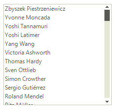

# Sorting

Sorting in __RadListControl__ is controlled by the __SortStyle__ property. The available sorting options are listed below:

* __Ascending__: indicates ascending sorting.
            

* __Descending__: indicates descending sorting.
            

* __None__: indicates no sorting. Items appear in the order of inserting.
            
>caption Figure 1: SortStyle.Descending



#### Setting Sorting 

{{source=..\SamplesCS\DropDownListControl\ListControl\ListControl1.cs region=sorting}} 
{{source=..\SamplesVB\DropDownListControl\ListControl\ListControl1.vb region=sorting}} 

````C#
            
radListControl1.SortStyle = Telerik.WinControls.Enumerations.SortStyle.Ascending;

````
````VB.NET
radListControl1.SortStyle = Telerik.WinControls.Enumerations.SortStyle.Ascending

````

{{endregion}} 
 
>caution Changing the __SortStyle__ property may cause the __SelectedIndexChanged__ event to fire if the position of the currently selected item has changed after the sort operation.