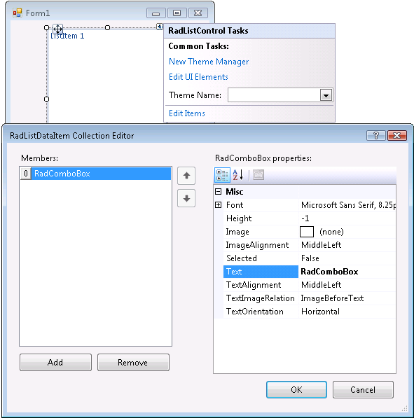
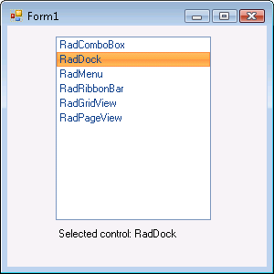

# Getting Started


| RELATED VIDEOS |  |
| ------ | ------ |
|[Getting Started with RadListControl](http://www.telerik.com/videos/winforms/getting-started-with-radlistcontrol)<br>In this video, you will learn how to bind data to the new RadListControl.||

## 

This tutorial demonstrates how to manually populate RadListControl and
how to react to a user choice in code.

1\. Place a __RadListControl__ and a __RadLabel__ control on a form.

2\. Select the __RadListControl__ control, open its __Smart Tag__ menu.

3\. Select the __Edit Items__ task.

4\. In the __RadItem Collection Editor__, click __Add__.

5\. Set the __Text__ property of the new __ListItem__ to "RadComboBox". 



6\. Add five more ListItems to the RadListControl. Set their __Text__ properties to "RadDock", "RadMenu", "RadRibbonBar", "RadGridView", and "RadPageView".

7\. Click __OK__.

8\. In the __Properties__ window, click the events button.

9\. Double-click the __SelectedIndexChanged__ event.

10\. Replace the automatically-generated event handler with this code:
#### Handling the SelectedIndexChanged event 

{{source=..\SamplesCS\DropDownListControl\ListControl\ListControl1.cs region=handlingSelectedIndexChanged}} 
{{source=..\SamplesVB\DropDownListControl\ListControl\ListControl1.vb region=handlingSelectedIndexChanged}} 

````C#
void radListControl1_SelectedIndexChanged(object sender, Telerik.WinControls.UI.Data.PositionChangedEventArgs e)
{
    RadListDataItem item = this.radListControl1.SelectedItem as RadListDataItem;
    radLabel1.Text = "Selected control: " + item.Text;
}

````
````VB.NET
Private Sub radListControl1_SelectedIndexChanged(ByVal sender As Object, ByVal e As Telerik.WinControls.UI.Data.PositionChangedEventArgs)
    Dim item As RadListDataItem = TryCast(Me.radListControl1.SelectedItem, RadListDataItem)
    radLabel1.Text = "Selected control: " & item.Text
End Sub

````

{{endregion}} 


11\. Press __F5__ to run the project. Select an item in the list box and note the value of the label.


