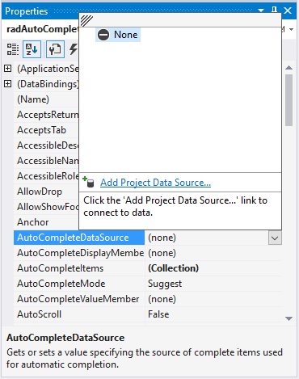
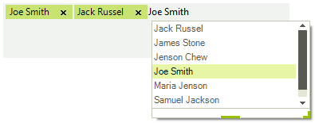

# Auto-Complete

## 

The RadAutoCompleteBox can automatically complete the input string by comparing 
	       the prefix being entered to the prefix of all strings in the maintained source.
	       This is useful for RadAutoCompleteBox in which URLs, addresses, file names or commands
	       will be frequently entered.
        

There are four different completion modes:

* __Append__ - Appends the remainder of the most likely candidate
				string to the existing characters, highlighting the appended characters. 
		  	

* __None__ - disables the automatic completion feature. 
		 	 

* __Suggest__ - Displays the auxiliary drop-down list associated 
				with the edit control. This drop-down is populated with all matching completion strings.
		 	 

* __SuggestAppend__ - Applies both Suggest and Append options.
		 	 

You can change the completion behavior by setting the AutoCompleteMode property.
			You can determine the items used for auto-completion by specifying a data source 
			or adding the items manually.
        

## Auto-completion data binding

RadAutoCompleteBox binds to collections of bindable types from many sources including:

* Array and ArrayList of simple types or custom objects.

* Generic Lists of simple types or custom objects.

* BindingList or other IBindingList implementations.

* Database data using DataTable and DataSet from a wide range of providers (MS SQL, Oracle, Access, anything accessible through OleDb).

Three properties control data binding:

* The __AutoCompleteDataSource__ property specifies the source of the data to be bound.

* The __AutoCompleteDisplayMember__ property specifies the particular data to be displayed in the auto-completion drop down.

* The __AutoCompleteValueMember__ property specifies the particular data to be returned as the value of the tokenized block element.

To set the AutoCompleteDataSource property, select the AutoCompleteDataSource property
			in the Properties window of Visual Studio, click the drop-down arrow to display all 
			existing data sources on the form. Click the Add Project Data Source link and follow 
			the instructions in the Data Source Configuration Wizard to add a data source to your
			project. You can use databases, web services, or objects as data sources.
        

__AutoCompleteDisplayMember__: To set the 
			__AutoCompleteDisplayMember__ property, first set the data source property.
			Then, select a value for the __AutoCompleteDisplayMember__ property from
			the drop-down list in the Properties window.
		

__AutoCompleteValueMember__: To set the 
			__AutoCompleteValueMember__ property, first set the 
			__AutoCompleteDataSource__ property. Then, select a value for the 
			__AutoCompleteValueMember__ property from the drop-down list in the Properties window.
		

## Auto-completion in unbound mode

To use auto-completion without specifying a data source, you need to populate
    	the items which will be used for completing the input string in RadAutoCompleteBox,
    	in the __Items__ collection of the control:
    

#### __[C#]__

{{source=..\SamplesCS\Editors\AutoCompleteBox.cs region=addItems}}
	        private void AddAutoCompleteItems()
	        {
	            RadListDataItemCollection items = this.radAutoCompleteBox1.AutoCompleteItems;
	
	            items.Add(new RadListDataItem("Joe Smith", "joe@fakecompany.com"));
	            items.Add(new RadListDataItem("Adam Petersen", "adam@qwerty.com"));
	            items.Add(new RadListDataItem("Jack Russel", "jack@russel.nocom"));
	            items.Add(new RadListDataItem("Daniel Finger", "daniel.pinger@gmail.com"));
	            items.Add(new RadListDataItem("Richard Vail", "rvail@richardvail.com"));
	            items.Add(new RadListDataItem("Sebastian Jonnson", "s.jonnson@sjonnson.com"));
	            items.Add(new RadListDataItem("Lee Cooper", "lee.cooper@coopercoorp.com"));
	            items.Add(new RadListDataItem("Kelvin Clain", "kclain@clainkevin.com"));
	            items.Add(new RadListDataItem("Maria Jenson", "mjenson@mariajenson.com"));
	            items.Add(new RadListDataItem("Chelsea Maarten", "chelsea@maarten.com"));
	            items.Add(new RadListDataItem("Jenson Chew", "jenson.chew@nospam.com"));
	            items.Add(new RadListDataItem("Martin Williams", "m.williams@martinandwilliams.com"));
	            items.Add(new RadListDataItem("Telerik", "clientservice@telerik.com"));
	            items.Add(new RadListDataItem("James Stone", "james.stone@manystones.com"));
	            items.Add(new RadListDataItem("Samuel Jackson", "samuel.jackson@nojackson.com"));
	        }
	{{endregion}}

#### __[VB.NET]__

{{source=..\SamplesVB\Editors\AutoCompleteBox.vb region=addItems}}
	    Private Sub AddAutoCompleteItems()
	        Dim items As RadListDataItemCollection = Me.RadAutoCompleteBox1.AutoCompleteItems
	
	        items.Add(New RadListDataItem("Joe Smith", "joe@fakecompany.com"))
	        items.Add(New RadListDataItem("Adam Petersen", "adam@qwerty.com"))
	        items.Add(New RadListDataItem("Jack Russel", "jack@russel.nocom"))
	        items.Add(New RadListDataItem("Daniel Finger", "daniel.pinger@gmail.com"))
	        items.Add(New RadListDataItem("Richard Vail", "rvail@richardvail.com"))
	        items.Add(New RadListDataItem("Sebastian Jonnson", "s.jonnson@sjonnson.com"))
	        items.Add(New RadListDataItem("Lee Cooper", "lee.cooper@coopercoorp.com"))
	        items.Add(New RadListDataItem("Kelvin Clain", "kclain@clainkevin.com"))
	        items.Add(New RadListDataItem("Maria Jenson", "mjenson@mariajenson.com"))
	        items.Add(New RadListDataItem("Chelsea Maarten", "chelsea@maarten.com"))
	        items.Add(New RadListDataItem("Jenson Chew", "jenson.chew@nospam.com"))
	        items.Add(New RadListDataItem("Martin Williams", "m.williams@martinandwilliams.com"))
	        items.Add(New RadListDataItem("Telerik", "clientservice@telerik.com"))
	        items.Add(New RadListDataItem("James Stone", "james.stone@manystones.com"))
	        items.Add(New RadListDataItem("Samuel Jackson", "samuel.jackson@nojackson.com"))
	    End Sub
	{{endregion}}

Here is the result of the above code:
