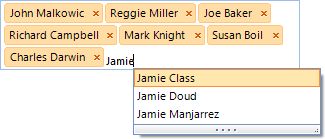

# AutoCompleteBox

RadAutoCompleteBox allows the end-user to easily fill-in text thanks to auto-complete functionality and tokens of text. This behavior is similar to the “To” field of Outlook and Facebook where you are filling-in the recipients to which you are going to send a new message:
      

Key Features:

* Different layout modes

* Outlook style auto-complete in bound and unbound mode

* Customizable appearance and theming mechanism

* Selection and navigation

* Localizable context menu  

* Flexible and intuitive API

* IME support

## 
