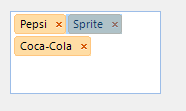

# Caret positioning and selection


## 

The positioning and selection in RadAutoCompleteBox can be performed programmatically
          as well as by using the keyboard and mouse input.
        

the keyboard (up, down, left, right buttons).
          To select text you can press the shift key followed by left mouse button or one of the navigation keys of
        

Programmatic selection can be performed by using the __SelectionStart__
          and __SelectionLength__ properties of RadAutoCompleteBox.
        

The __SelectionStart__ property is an integer that indicates the insertion
          point within the string of text, with 0 being the left-most position. If the
          __SelectionStart__ property is set to a value equal to or greater
          than the number of characters in the text box, the insertion point is placed after the last character.
        

Setting the __SelectionLength__ to a number greater than 0 causes that number
          of characters to be selected, starting from the current insertion point.
        #_[C#] _

	


{{source=..\SamplesCS\editors\AutoCompleteBox.cs region=SetSelection}} 
{{source=..\SamplesVB\editors\AutoCompleteBox.vb region=SetSelection}} 

````C#
        private void SetSelection()
        {
            this.radAutoCompleteBox1.Text = "Pepsi; Sprite; Coca-Cola;";
            this.radAutoCompleteBox1.SelectionStart = 6;
            this.radAutoCompleteBox1.SelectionLength = 7;
        }
````
````VB.NET
    Private Sub SetSelection()
        Me.RadAutoCompleteBox1.Text = "Pepsi; Sprite; Coca-Cola;"
        Me.RadAutoCompleteBox1.SelectionStart = 6
        Me.RadAutoCompleteBox1.SelectionLength = 7
    End Sub
````

{{endregion}} 


Alternatively, you can use the __Select__ method to select the same part of the text:
        #_[C#] _

	


{{source=..\SamplesCS\editors\AutoCompleteBox.cs region=SetSelectionRange}} 
{{source=..\SamplesVB\editors\AutoCompleteBox.vb region=SetSelectionRange}} 

````C#
        private void SetSelectionRange()
        {
            this.radAutoCompleteBox1.Text = "Pepsi;Sprite;Coca-Cola";
            this.radAutoCompleteBox1.Select(6, 7);
        }
````
````VB.NET
    Private Sub SetSelectionRange()
        Me.RadAutoCompleteBox1.Text = "Pepsi;Sprite;Coca-Cola"
        Me.RadAutoCompleteBox1.[Select](6, 7)
    End Sub
````

{{endregion}} 


The both approaches produce same result:
