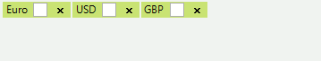

# Creating Custom Blocks

__RadAutoCompleteBox__ allows not only appearance customization via the formatting event, but also replacement of the default UI block representation. The __CreateTextBlock__ event exposes this possibility.
        

You should create a custom text block that inherits from __ITextBlock__ and any inheritor of __RadElement__. Let’s extend the default __TokenizedTextBlockElement__ by adding a check box. You don’t need to implement the __ITextBlock__ interface, because it is already defined in the base class: 

{{source=..\SamplesCS\Editors\AutoCompleteBox.cs region=customTokens}} 
{{source=..\SamplesVB\Editors\AutoCompleteBox.vb region=customTokens}} 

````C#
public class MyTokenizedTextBlockElement : TokenizedTextBlockElement
{
    private RadCheckBoxElement checkBox;
    protected override Type ThemeEffectiveType
    {
        get
        {
            return typeof(TokenizedTextBlockElement);
        }
    }
    protected override void CreateChildElements()
    {
        base.CreateChildElements();
        int index = this.Children.IndexOf(this.RemoveButton);
        this.checkBox = new RadCheckBoxElement();
        this.checkBox.StretchVertically = true;
        this.checkBox.StretchHorizontally = false;
        this.Children.Insert(index, this.checkBox);
    }
}

````
````VB.NET
Public Class MyTokenizedTextBlockElement
    Inherits TokenizedTextBlockElement
    Private checkBox As RadCheckBoxElement
    Protected Overrides ReadOnly Property ThemeEffectiveType() As Type
        Get
            Return GetType(TokenizedTextBlockElement)
        End Get
    End Property
    Protected Overrides Sub CreateChildElements()
        MyBase.CreateChildElements()
        Dim index As Integer = Me.Children.IndexOf(Me.RemoveButton)
        Me.checkBox = New RadCheckBoxElement()
        Me.checkBox.StretchVertically = True
        Me.checkBox.StretchHorizontally = False
        Me.Children.Insert(index, Me.checkBox)
    End Sub
End Class

````

{{endregion}}  

Then you should replace the default text block in the __CreateTextBlock__ event handler, in the following manner: 

{{source=..\SamplesCS\Editors\AutoCompleteBox.cs region=replaceTokens}} 
{{source=..\SamplesVB\Editors\AutoCompleteBox.vb region=replaceTokens}} 

````C#
private void radAutoCompleteBox1_CreateTextBlock(object sender, CreateTextBlockEventArgs e)
{
    if (e.TextBlock is TokenizedTextBlockElement)
    {
        e.TextBlock = new MyTokenizedTextBlockElement();
    }
}

````
````VB.NET
Private Sub radAutoCompleteBox1_CreateTextBlock(sender As Object, e As CreateTextBlockEventArgs)
    If TypeOf e.TextBlock Is TokenizedTextBlockElement Then
        e.TextBlock = New MyTokenizedTextBlockElement()
    End If
End Sub

````

{{endregion}} 
 
Finally, the text property should be set:

>tip The subscription to the event, should be introduced before setting the text of the control.
>
 

{{source=..\SamplesCS\Editors\AutoCompleteBox.cs region=SubscribeToCreateTextBlock}} 
{{source=..\SamplesVB\Editors\AutoCompleteBox.vb region=SubscribeToCreateTextBlock}}
````C#
radAutoCompleteBox1.CreateTextBlock+=new CreateTextBlockEventHandler(radAutoCompleteBox1_CreateTextBlock);
this.radAutoCompleteBox1.Text = "Euro;USD;GBP;";

````
````VB.NET
AddHandler RadAutoCompleteBox1.CreateTextBlock, AddressOf radAutoCompleteBox1_CreateTextBlock
Me.RadAutoCompleteBox1.Text = "Euro;USD;GBP;"

```` 


{{endregion}} 

The following image demonstrates the final result:




# See Also

* [Caret Positioning and Selection]()
 
* [Element Structure and Document Object Model]()
* [Properties and Events]()
* [Text Editing]()
* [Auto-Complete]()