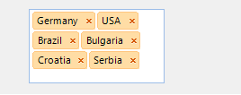
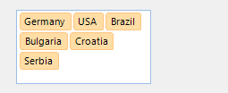

# Getting Started
 

| RELATED VIDEOS |  |
| ------ | ------ |
|[Getting Started with RadAutoCompleteBox for WinForms](http://tv.telerik.com/watch/radcontrols-for-winforms/getting-started-with-radautocompletebox-for-winforms) RadAutoCompleteBox allows the end-user to easily fill-in text thanks to auto-complete functionality and tokens of text. This behavior is similar to the “To” field of Outlook and Facebook where you are filling-in the recipients to which you are going to send a new message.||

## 

The RadAutoCompleteBox allows your users to select multiple items from a predefined list, using auto completion as they type. You may have seen a similar type of text entry when filling in the recipient’s field, while sending messages on Facebook. RadAutoCompleteBox inherits all features of [RadTextBoxControl]().
        

Each tokenized text block is separated by character, specified by the __Delimiter__ property. You can change the __Delimiter__ at any time.
         
The code below sets text in the control at run time: 

{{source=..\SamplesCS\editors\AutoCompleteBox.cs region=SetText}} 
{{source=..\SamplesVB\editors\AutoCompleteBox.vb region=SetText}} 

````C#
private void SetText()
{
    this.radAutoCompleteBox1.Text = "Germany;USA;Brazil;Bulgaria;Croatia;Serbia;";
}

````
````VB.NET
Private Sub SetText()
    Me.RadAutoCompleteBox1.Text = "Germany;USA;Brazil;Bulgaria;Croatia;Serbia;"
End Sub
 Region
Private Sub ShowRemoveButton()
    '#Region "ShowRemoveButton"
    Me.RadAutoCompleteBox1.ShowRemoveButton = False

````

{{endregion}} 
 
Here is the output:

You can determine the visibility of the remove button by changing the __ShowRemoveButton__ property: 


{{source=..\SamplesCS\editors\AutoCompleteBox.cs region=ShowRemoveButton}} 
{{source=..\SamplesVB\editors\AutoCompleteBox.vb region=ShowRemoveButton}} 

````C#
this.radAutoCompleteBox1.ShowRemoveButton = false;

````
````VB.NET
Me.RadAutoCompleteBox1.ShowRemoveButton = False

````

{{endregion}} 




To access the tokenized items use the __Items__ collection property of RadAutoCompleteBox: 

{{source=..\SamplesCS\editors\AutoCompleteBox.cs region=AccessToken}} 
{{source=..\SamplesVB\editors\AutoCompleteBox.vb region=AccessToken}} 

````C#
RadTokenizedTextItem thirdToken = radAutoCompleteBox1.Items[2];

````
````VB.NET
Dim thirdToken As RadTokenizedTextItem = RadAutoCompleteBox1.Items(2)

````

{{endregion}} 
  
Setting the __NullText__ property will display a custom string when the Text property is empty or null:


