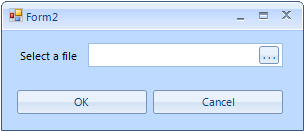

# Browse Editor

## 

RadBrowseEditor is a themable control which allows users to select a file
        	or a directory from the file system using OpenFileDialog, FolderBrowserDialog 
        	or directly to type the full path to the file.
