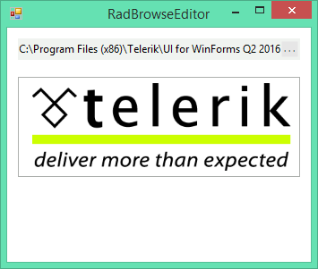

# Dialog Types

The following example demonstrates how to change the image of a __RadButton__ using the __RadBrowseEditor__.

>caption Figure 1: Browsed Image

## See Also

* [Structure]()
* [Smart Tag]()
* [Dialog Type]()
