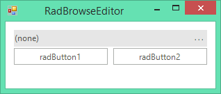

# Browse Editor

__RadBrowseEditor__ is a themable control which allows users to select a file or a directory from the file system or directly type the full path to it in the editor.

>caption Figure 1: RadBrowseEditor

The dialog type is determined by the __BrowseEditorDialogType__ enumeration and defined through the __DialogType__ property.

## See Also

* [Structure]()
* [Getting Started]()
* [Smart Tag]()
* [Dialog Type]()