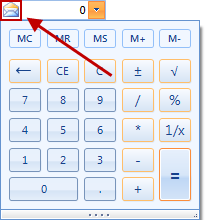
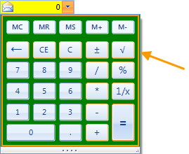
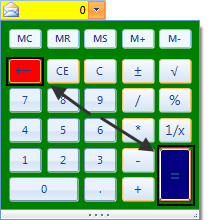

# Customization

This topic will demonstrate how to access different element in the control in order to change their appearance.
      

## Modify the appearance of the memory element

#### __[C#] __

{{source=..\SamplesCS\Editors\RadCalculatorDropDownCustomization.cs region=ChangeTheImageOfMemoryElement}}
	            radCalculatorDropDown1.CalculatorElement.MemoryElement.Image = Resources.email;
	{{endregion}}

#### __[VB.NET] __

{{source=..\SamplesVB\Editors\RadCalculatorDropDownCustomization.vb region=ChangeTheImageOfMemoryElement}}
	        RadCalculatorDropDown1.CalculatorElement.MemoryElement.Image = My.Resources.email
	{{endregion}}

## Modify the appearance of the  of the text box

#### __[C#] __

{{source=..\SamplesCS\Editors\RadCalculatorDropDownCustomization.cs region=ChangeTheBackColorOfTheTextBox}}
	            radCalculatorDropDown1.CalculatorElement.FillPrimitive.BackColor = Color.Yellow;
	            radCalculatorDropDown1.CalculatorElement.EditorContentElement.Fill.BackColor = Color.Yellow;
	{{endregion}}

#### __[VB.NET] __

{{source=..\SamplesVB\Editors\RadCalculatorDropDownCustomization.vb region=ChangeTheBackColorOfTheTextBox}}
	        RadCalculatorDropDown1.CalculatorElement.FillPrimitive.BackColor = Color.Yellow
	        RadCalculatorDropDown1.CalculatorElement.EditorContentElement.Fill.BackColor = Color.Yellow
	{{endregion}}

## Modify the appearance of the calculator in the popup

#### __[C#] __

{{source=..\SamplesCS\Editors\RadCalculatorDropDownCustomization.cs region=ChangeTheBackColorOfTheCalculator}}
	            radCalculatorDropDown1.CalculatorElement.CalculatorContentElement.BackColor = Color.Green;
	{{endregion}}

#### __[VB.NET] __

{{source=..\SamplesVB\Editors\RadCalculatorDropDownCustomization.vb region=ChangeTheBackColorOfTheCalculator}}
	        RadCalculatorDropDown1.CalculatorElement.CalculatorContentElement.BackColor = Color.Green
	{{endregion}}

## Modify the appearance of the of the buttons

#### __[C#] __

{{source=..\SamplesCS\Editors\RadCalculatorDropDownCustomization.cs region=ChangeTheBackColorOfButtons}}
	            radCalculatorDropDown1.CalculatorElement.CalculatorContentElement.ButtonEquals.GradientStyle = Telerik.WinControls.GradientStyles.Solid;
	            radCalculatorDropDown1.CalculatorElement.CalculatorContentElement.ButtonEquals.BackColor = Color.Navy;
	            
	            radCalculatorDropDown1.CalculatorElement.CalculatorContentElement.ButtonDelete.GradientStyle = Telerik.WinControls.GradientStyles.Solid;
	            radCalculatorDropDown1.CalculatorElement.CalculatorContentElement.ButtonDelete.BackColor = Color.Red;
	{{endregion}}

#### __[VB.NET] __

{{source=..\SamplesVB\Editors\RadCalculatorDropDownCustomization.vb region=ChangeTheBackColorOfButtons}}
	        RadCalculatorDropDown1.CalculatorElement.CalculatorContentElement.ButtonEquals.GradientStyle = Telerik.WinControls.GradientStyles.Solid
	        RadCalculatorDropDown1.CalculatorElement.CalculatorContentElement.ButtonEquals.BackColor = Color.Navy
	
	        RadCalculatorDropDown1.CalculatorElement.CalculatorContentElement.ButtonDelete.GradientStyle = Telerik.WinControls.GradientStyles.Solid
	        RadCalculatorDropDown1.CalculatorElement.CalculatorContentElement.ButtonDelete.BackColor = Color.Red
	{{endregion}}

