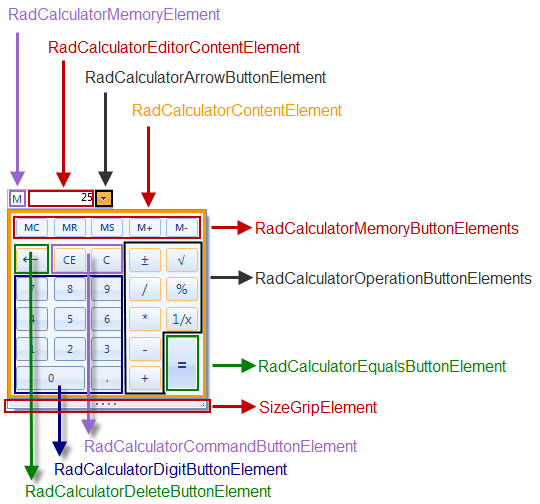

# Element structure

## 

__RadCalculatorDropDown__ consist of two parts - editable part which is the actual editor and a popup which hosts the calculator.

## Editable area

The editable area consists of three elements:

* __RadCalculatorMemoryElement__ - this element gets visible when the memory functions of the calculator are used
            

* __RadCalculatorEditorContentElement__ - this is the editable area of the control
            

* __RadCalculatorArrowButtonElement__ - this the arrow button which opens the popup of the control
            

## Dropdown

The popup contains two main elements: __RadCalculatorContentElement__ which holds all elements that makeup the calculator and a __SizeGridElement__ which allows resizing of the dropdown. 
        

Here is a detailed list of the elements in __RadCalculatorContentElement__

* __RadCalculatorMemoryButtonElement__ - this is the type of the buttons for memory operations
            

* __RadCalculatorOperationButtonElement__ - this type is used by the buttons resposinble for different calculation operations (subscription, addition, etc)
            

* __RadCalculatorEqualsButtonElement__ - this class is used by the equals button
            

* __RadCalculatorCommandButtonElement__ - this class is used by the command buttons (CE, C)
            

* __RadCalculatorDeleteButtonElement__ - this type is used by the delete button
            

* __RadCalculatorDigitButtonElement__ - this type is used by the digit buttons
            
