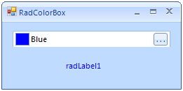

# Getting Started

## 

The following example demonstrates how to change the __ForeColor__ 
        of __RadLabel__ by using the __RadColorBox__.
		

1. Drag __RadLabel__ and __RadColorBox__ to a form.

1. Select the __RadColorBox__, click the __Events tab__ of the 
          __Property Window__, locate the __ValueChanged__ event and double-click it to create an event handler. 
          Replace the event handler with the following code.
      			

#### __[C#]__

{{source=..\SamplesCS\Editors\ColorBox1.cs region=colorBoxValueChanged}}
	        private void radColorBox1_ValueChanged(object sender, EventArgs e)
	        {
	            this.radLabel1.ForeColor = this.radColorBox1.Value;
	        }
	{{endregion}}

#### __[VB.NET]__

{{source=..\SamplesVB\Editors\ColorBox1.vb region=colorBoxValueChanged}}
	    Private Sub RadColorBox1_ValueChanged(sender As Object, e As EventArgs)
	        Me.RadLabel1.ForeColor = Me.RadColorBox1.Value
	    End Sub
	{{endregion}}

1. Press __F5__ to run the application. Press the color dialog button and select a color. 
          The color is then applied as the __ForeColor__ of the __RadLabel__.
