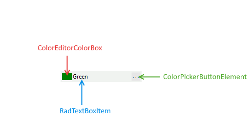
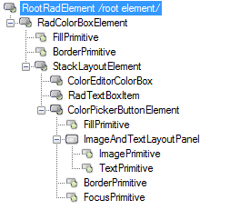

# Structure

The bellow image shows the structure of RadColorBox.

>caption Figure 1: RadColorBox elements.

* __ColorPickerColorBox:__ This element shows the currently selected color.
* __RadTextBoxItem:__ This element displays the color name or the color code in RGB or HEX format. 
* __ColrPickerButtonElement:__ Opens the color dialog where the user can choose the desired color. 

# Elements hierarchy

>caption Figure 2: The RadColorBox Elements hierarchy.

 

 # See Also

 
* [Design Time]()
* [Getting Started]()
* [Properties and Events]()