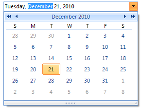
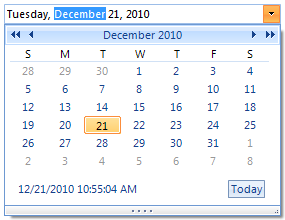

# DateTimePicker
 
## 

__RadDateTimePicker__ allows interactive selection of dates using a drop down calendar. Features of __RadDateTimePicker__ include:

* Internationalization support.

* Support for theming via pre-defined themes that ship with the product or use the Visual Style Builder to alter or create your own themes.

* Supports multiple built-in date formats or custom formats.

