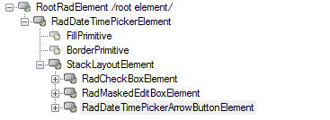

# Structure

The bellow image shows the structure of RadDateTiemPicker.

>caption Figure 1: RadDateTimePicker structure.

## Elements Hierarchy

Figure 2 shows the elements used in RadDateTimePicker.

>caption Figure 2: RadDatatimePicker elements hierarchy.

