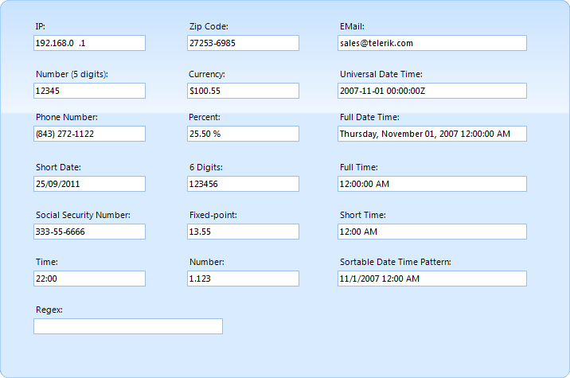
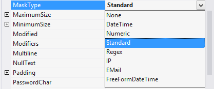
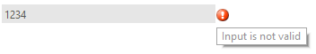
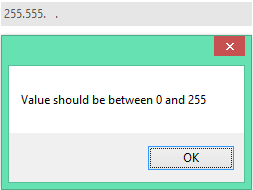
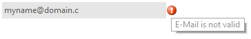

# MaskedEditBox

__RadMaskedEditBox__ is a themeable text box that formats and constrains text to a predefined pattern or a pattern you define. __RadMaskedEditBox__ also handles globalization for date and time edits. Date and Time masks allow the user to navigate using the up and down arrow keys.

>caption Figure 1: RadMaskedEditBox Types

The __MaskType__ property defines what type of mask would be used in the masked box:

>caption Figure 2: MaskType Property

* __None__

* __[DateTime]()__

* __[Numeric]()__

* __[Standard]()__

* __Regex__: For example mask __[A-z]__ will check for at least one symbol in this range (A-z) in __RadMaskEditBox__’s text:

>caption Figure 3: Regex Mask

* __IP__: Allows user to input only __3__ digits in __0-255__ range in __four__ groups.

>caption Figure 4: IP Mask

* __Email__: Validate user input for the valid mail. If this email is not valid will notify user with validation icon:

>caption Figure 5: Email Mask

Additional features supported by __RadMaskedEditoBox__ are:

* __Null value support__

* __Easy navigation between text parts of DateTimeMask__

## See Also

* [Structure]()
* [Smart Tag]()
* [Getting Started]()