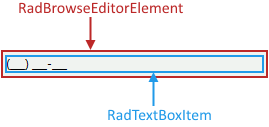

# Structure

This article describes the inner structure and organization of the elements which build the __RadMaskedEditBox__ control.

>caption Figure 1: RadMaskedEditBox`s Element Hierarchy

>caption Figure 2: RadMaskedEditBox`s Structure

1. __RadMaskedEditBoxElement:__ Represents the main element of __RadMaskedEditBox__.
1. __RadTextBoxItem:__ Text box handling user input.

## See Also

* [Smart Tag]()
* [Getting Started]()