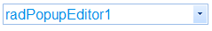
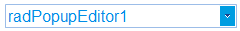
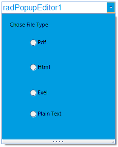

# Customize Elements


## Customizing the Text Box

You can access the text box by using the __TextBoxElement__ property.
          This allows you to change any property specific to the text box.
          For example the following code snippet shows how you can change the __Font__ and the __ForeColor__:
        #_[C#] Customize TextBoxElement_

	


{{source=..\SamplesCS\Editors\PopupEditor\PopupEditorCode.cs region=TextBox}} 
{{source=..\SamplesVB\Editors\PopupEditor\PopupEditorCode.vb region=TextBox}} 

````C#
radPopupEditor1.TextBoxElement.Font = new Font("Arial", 12, FontStyle.Regular);
radPopupEditor1.TextBoxElement.ForeColor = ColorTranslator.FromHtml("#008de7");

````
````VB.NET
radPopupEditor1.TextBoxElement.Font = New Font("Arial", 12, FontStyle.Regular)
radPopupEditor1.TextBoxElement.ForeColor = ColorTranslator.FromHtml("#008de7")

````

{{endregion}} 


>caption Figure 1: Customizing the text box Font and ForeColor.



## Customizing the Arrow Button

The arrow button can be accessed via the __ArrowButtonElement__ property.
          The following example shows how you can access and set the __BackColor__ of the button:
        #_[C#] Set arrow button BackColor _

	


{{source=..\SamplesCS\Editors\PopupEditor\PopupEditorCode.cs region=Button}} 
{{source=..\SamplesVB\Editors\PopupEditor\PopupEditorCode.vb region=Button}} 

````C#
radPopupEditor1.PopupEditorElement.ArrowButtonElement.Fill.BackColor = ColorTranslator.FromHtml("#009de1");
radPopupEditor1.PopupEditorElement.ArrowButtonElement.Fill.GradientStyle = Telerik.WinControls.GradientStyles.Solid;

````
````VB.NET
radPopupEditor1.PopupEditorElement.ArrowButtonElement.Fill.BackColor = ColorTranslator.FromHtml("#009de1")
radPopupEditor1.PopupEditorElement.ArrowButtonElement.Fill.GradientStyle = Telerik.WinControls.GradientStyles.Solid

````

{{endregion}} 


>caption Figure 2: Set Arrow Button BackColor.



## Customizing the Popup

The popup can be access with the __Popup__ property. This gives you access to all public popup properties and elements.
        For example you can change the __BackColor__ of the popup like this:
      #_[C#] Change Popup BackColor_

	


{{source=..\SamplesCS\Editors\PopupEditor\PopupEditorCode.cs region=DropDown}} 
{{source=..\SamplesVB\Editors\PopupEditor\PopupEditorCode.vb region=DropDown}} 

````C#
void RadForm1_Load(object sender, EventArgs e)
{
    radPopupEditor1.Popup.BackColor = ColorTranslator.FromHtml("#009de1");
}

````
````VB.NET
Private Sub RadForm1_Load(ByVal sender As Object, ByVal e As EventArgs)
    radPopupEditor1.Popup.BackColor = ColorTranslator.FromHtml("#009de1")
End Sub

````

{{endregion}} 


>caption Figure 3: Change Popup BackColor.



# See Also

 * [Properties, Events and Methods]()
