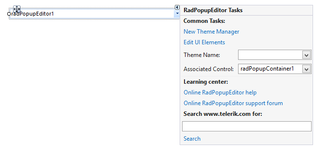
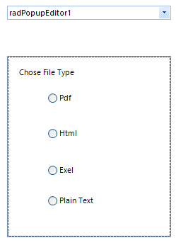

# Design Time

## 

To start using __RadPopupEditor__ just drag and drop it on the form. The smart tag allows you to set the associated __RadPopupContainer__ or the theme.
        
>caption Figure 1: RadPopupEditor smart tag.

The control allows building the drop down layout at design time. For the purpose you should add [RadPopupContainer]() as well. Once all controls are added to the container you should just associate it with the __RadPopupEditor__ and the controls will appear in the popup.
      
>caption Figure 2: Sample layout built at design time.

# See Also

 * [PopupContainer]()

 * [Getting Started]()
