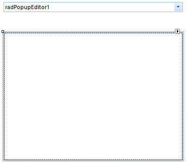
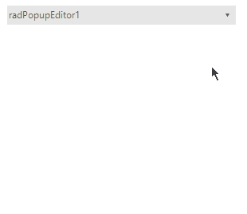

# Getting Started


## 

This article shows how you can start using __RadPopupEditor__. Go ahead and add __RadPoupEditor__ and __RadPoupContainer__ to a form. The result should look like in Figure 1.
      
>caption Figure 1: RadPopupEditor and RadPoupCintainer at design time.



Add three text boxes, four labels and two buttons to the __RadPopupContainer__. Arrange the controls like in Figure 2.
        
>caption Figure 2: Sample Layout.


Add __Click__ event handlers for the both buttons and then use the following code in them:

#### Buttons event handlers 

{{source=..\SamplesCS\Editors\PopupEditor\PopupEditorCode.cs region=EventHandlers}} 
{{source=..\SamplesVB\Editors\PopupEditor\PopupEditorCode.vb region=EventHandlers}} 

````C#
private void radButton1_Click(object sender, EventArgs e)
{
    this.radPopupEditor1.Text = radTextBox1.Text + " " + radTextBox2.Text;
    radPopupEditor1.PopupEditorElement.ClosePopup();
}
private void radButton2_Click(object sender, EventArgs e)
{
    this.radPopupEditor1.Text = "";
    radTextBox1.Text = "";
    radTextBox2.Text = "";
    radTextBox3.Text = "";
    radPopupEditor1.PopupEditorElement.ClosePopup();
}

````
````VB.NET
Private Sub radButton1_Click(ByVal sender As Object, ByVal e As EventArgs)
    Me.radPopupEditor1.Text = radTextBox1.Text & " " & radTextBox2.Text
    radPopupEditor1.PopupEditorElement.ClosePopup()
End Sub
Private Sub radButton2_Click(ByVal sender As Object, ByVal e As EventArgs)
    Me.radPopupEditor1.Text = ""
    radTextBox1.Text = ""
    radTextBox2.Text = ""
    radTextBox3.Text = ""
    radPopupEditor1.PopupEditorElement.ClosePopup()
End Sub

````

{{endregion}} 


This way when __Submit__ is pressed the name will be displayed in the control's text box.
        
>caption Figure 3: The final result.


