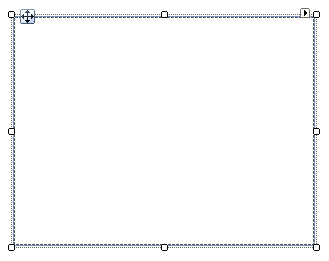

# PopupContainer

## 

__RadPopupContainer__ is a simple scrollable panel which is used with __RadPopupEditor__. It allows you to build your layout at design time. Once this is done, you can just associate the panel with the __RadPopupEditor__.
        
>caption Figure 1: RadPopupContainer.

# See Also

 * [RadScrollablePanel]()

 * [Getting Started]()
