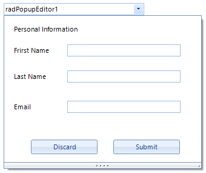

# PopupEditor

RadPopupEditor control allows you to show any predefined or custom controls in its popup. By default the control should be associated with a RadPopupContainer. RadPoupContainer on the other hand allows you to build your layout at design time. The controls added to the container will be shown in the popup window when the popup is opened.

Features:
* With this control you can easily create custom drop down editor which contains complex custom layout.
* Resizing the popup at runtime.
* Adding and arranging controls at design time.
* Display a value in the control text box.

