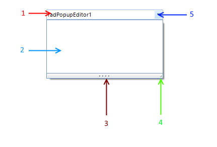

# Structure

## 

This article shows the control element structure.
>caption Figure 1: The RadPopupEditor structure.

1. __Text Box__ - displays a text value.
            

1. __Popup__ - in this area you can build your layout.
            

1. __UpDown resize grip__ - used for resizing in vertical direction
            

1. __RightBottom resize grip__ - used for resizing in all directions.
            

1. __Arrow button__ - used for showing/closing the drop down.
            
