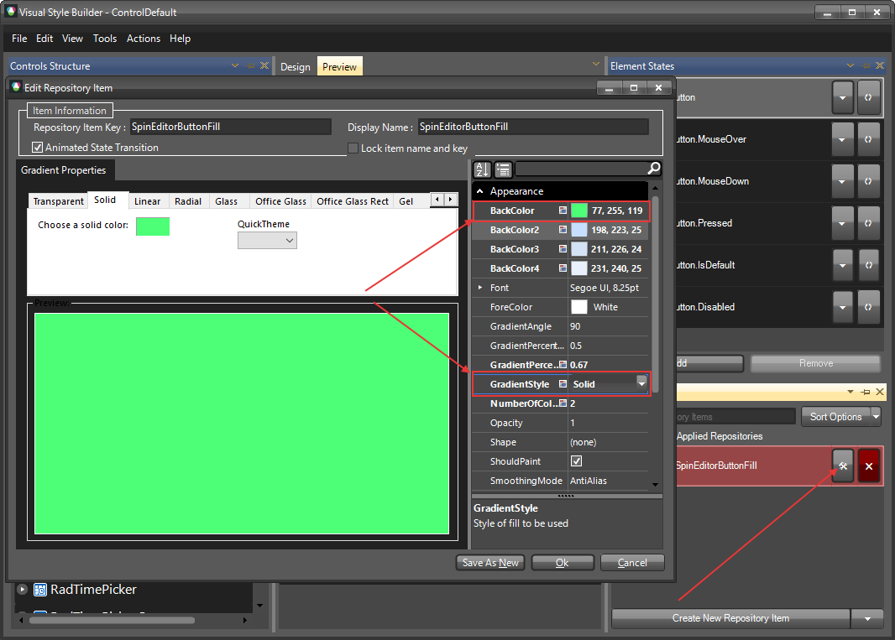

# Themes

This help article will demonstrate a step by step tutorial how to customize the `ControlDefault` theme for __Radspineditor__

1. Open [Visual Style Builder] ()
2. Export the built-in themes in a specific folder by selecting `File` >> `Export Built-in Themes`.
3. Load a desired theme from the just exported files by selecting `File` >> `Open Package`.
4. Expand __RadSpinEditor__ and select the `RadArrowButtonFill`. 
    

5. Open the `Edit Repository Item` dialog and change the `BackColor` and the `GradientStyle`:
   

6. The BackColor of the bot buttons is chenged because the same repository item is applied to them:
   

>note The following article shows how you can use the new theme: [Using Custom Themes]().

# See Also 

* [Customizing Appearance]()

