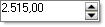

# Working with RadSpinEditor
 
## Properties

__InterceptArrowKeys__: This property when true (the default) allows the user to press the UP ARROW and DOWN ARROW keys to select values. The focus must be on the control for this functionality. 

__ReadOnly__: When this property is set to true the end user cannot change the control value. By default this property is turned off. 

__RightToLeft:__ If this property is set to __Yes__ the arrow buttons are displayed on the left, text on the right.

__Value, Minimum, Maximum__: The number displayed in the edit can be set or returned using the __Value__ property. Use the __Minimum__ and __Maximum__ properties to limit the upper and lower bounds that a value may be set to.

__Increment__: The amount incremented or decremented when the user clicks the up or down arrow buttons. By default this value is "1".

__ThousandsSeparator__: This property when true displays a thousands separator. By default this property is set to false. The __ThousandsSeparator__ display respects current culture settings as in the example below where the culture is set to German, __ThousandsSeparator__ is true and __DecimalPlaces__ is set to "2".



#### Setting the Thousands separator 

{{source=..\SamplesCS\Editors\SpinEditor1.cs region=thousandsSeparator}} 
{{source=..\SamplesVB\Editors\SpinEditor1.vb region=thousandsSeparator}} 

````C#
void Form1_Load(object sender, EventArgs e)
{
    Thread.CurrentThread.CurrentCulture = new CultureInfo("de-DE");
    radSpinEditor1.DecimalPlaces = 2;
    radSpinEditor1.ThousandsSeparator = true;
}

````
````VB.NET
Private Sub Form1_Load(ByVal sender As Object, ByVal e As System.EventArgs) Handles Me.Load
    Thread.CurrentThread.CurrentCulture = New CultureInfo("de-DE")
    RadSpinEditor1.DecimalPlaces = 2
    RadSpinEditor1.ThousandsSeparator = True
End Sub

````

{{endregion}} 
 
## Events

__ValueChanging__: This event fires before the value has changed and allows you to prevent a given value from being entered. The event passes a __ValueChangingEventArgs__ parameter that includes the __OldValue__, __NewValue__ and __Cancel__ properties. Set __Cancel__ to true to prevent the change to the __NewValue__. The example below stops the value from changing if the new value is greater than twice the size of the old value.

#### Cancel changing the value 

{{source=..\SamplesCS\Editors\SpinEditor1.cs region=cancelChanging}} 
{{source=..\SamplesVB\Editors\SpinEditor1.vb region=cancelChanging}} 

````C#
void radSpinEditor1_ValueChanging(object sender, Telerik.WinControls.UI.ValueChangingEventArgs e)
{
    e.Cancel = Convert.ToDecimal(e.NewValue) * 2 > Convert.ToDecimal(e.OldValue);
}

````
````VB.NET
Private Sub RadSpinEditor1_ValueChanging(ByVal sender As Object, ByVal e As Telerik.WinControls.UI.ValueChangingEventArgs) Handles RadSpinEditor1.ValueChanging
    e.Cancel = Convert.ToDecimal(e.NewValue) * 2 > Convert.ToDecimal(e.OldValue)
End Sub

````

{{endregion}} 
 
__ValueChanged__: This event fires when the number has already changed. Use the __Value__ property to get the current number in the __RadSpinEditor__.
