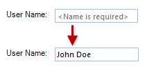

# Properties

__RadTextBox__ shares most of the properties of the standard Windows Forms text box, including:

|Property|Description|
|---|---|
|__BackColor__|Gets or sets the background color of the control.|
|__ForeColor__|Gets or sets the fore color of the text.|
|__Text__|Gets or sets the current text in the control.|
|__CharacterCasing__|specifies whether the user can type upper-case, lower-case, or both.|
|__MaxLength__|sets the maximum number of characters that can be typed into the control. |
|__MultiLine__|controls whether multiple lines of text can be displayed in the control. |
|__UseSystemPasswordChar__|Gets or sets a value indicating whether the text should appear as the default password character.|

## NullText

In addition, __RadTextBox__ has a new property not shared by the standard Windows Forms text box:

* The __NullText__ property specifies text to be displayed when the control has no __Text__ value. When the control receives the focus, this text is automatically removed. 

>caption Figure 1: Using the null text.

# See Also

* [Design Time]()
* [Structure]()
* [Adding Buttons to RadTextBox]()