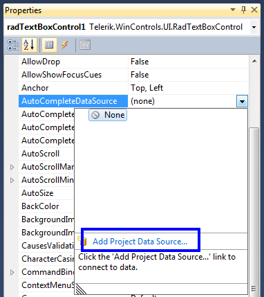
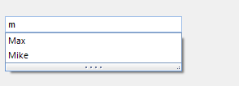

# AutoComplete
 

## 

The RadTextBoxControl can automatically complete the input string by comparing the prefix being entered to the prefix of all strings in the maintained source. This is useful for RadTextBoxControl in which URLs, addresses, file names or commands will be frequently entered.
        

There are four different completion modes:

* __Append__ - Appends the remainder of the most likely candidate string to the existing characters, highlighting the appended characters.
		  	

* __None__ - Disables the automatic completion feature. 
		  	

* __Suggest__ - Displays the auxiliary drop-down list associated with the control. This drop-down is populated with the matching completion strings.
		  	

* __SuggestAppend__ - Applies both Suggest and Append options.
		  	

You can change the completion behavior by setting the AutoCompleteMode property. You can determine the items used for auto-completion by specifying a data source or adding the items manually.
		

## Auto-completion data binding

RadTextBoxControl binds to collections of bindable types from many sources including:

* Array and ArrayList of simple types or custom objects.
				

* Generic Lists of simple types or custom objects.
				

* BindingList or other IBindingList implementations.
				

* Database data using DataTable and DataSet from a wide range of providers (MS SQL, Oracle, Access, anything accessible through OleDb).
				

Two properties control data binding:

* The __AutoCompleteDataSource__ property specifies the source of the data to be bound.
				

* The __AutoCompleteDisplayMember__ property specifies the particular data to be displayed in a RadTextBoxControl auto-completion drop down.
				

To set the __AutoCompleteDataSource__ property, select the __AutoCompleteDataSource__ property in the Properties window, click the drop-down arrow to display all existing data sources on the form. Click the Add Project Data Source link and follow the instructions in the Data Source Configuration Wizard to add a data source to your project. You can use databases, web services, or objects as data sources.



To set the __AutoCompleteDisplayMember__ property, first set the data source property. Then, select a value for the __AutoCompleteDisplayMember__ property from the drop-down list in the Properties window.
		

## Auto-completion in unbound mode

To use auto-completion without specifying a data source, you need to populate the items which will be used for completing the input string in RadTextBoxControl, in the __Items__ collection of the control: 

{{source=..\SamplesCS\Editors\TextBoxControl.cs region=AddAutoCompleteItems}} 
{{source=..\SamplesVB\Editors\TextBoxControl.vb region=AddAutoCompleteItems}} 

````C#
private void AddAutoCompleteItems()
{
    this.radTextBoxControl1.AutoCompleteMode = AutoCompleteMode.Suggest;
    RadListDataItemCollection autoCompleteItems = this.radTextBoxControl1.AutoCompleteItems;
    autoCompleteItems.Add(new RadListDataItem("Luke"));
    autoCompleteItems.Add(new RadListDataItem("Max"));
    autoCompleteItems.Add(new RadListDataItem("Adam"));
    autoCompleteItems.Add(new RadListDataItem("Henry"));
    autoCompleteItems.Add(new RadListDataItem("Jack"));
    autoCompleteItems.Add(new RadListDataItem("Ben"));
    autoCompleteItems.Add(new RadListDataItem("Tyler"));
    autoCompleteItems.Add(new RadListDataItem("Ethan"));
    autoCompleteItems.Add(new RadListDataItem("David"));
    autoCompleteItems.Add(new RadListDataItem("Mike"));
}

````
````VB.NET
Private Sub AddAutoCompleteItems()
    Me.RadTextBoxControl1.AutoCompleteMode = AutoCompleteMode.Suggest
    Dim autoCompleteItems As RadListDataItemCollection = Me.RadTextBoxControl1.AutoCompleteItems
    autoCompleteItems.Add(New RadListDataItem("Luke"))
    autoCompleteItems.Add(New RadListDataItem("Max"))
    autoCompleteItems.Add(New RadListDataItem("Adam"))
    autoCompleteItems.Add(New RadListDataItem("Henry"))
    autoCompleteItems.Add(New RadListDataItem("Jack"))
    autoCompleteItems.Add(New RadListDataItem("Ben"))
    autoCompleteItems.Add(New RadListDataItem("Tyler"))
    autoCompleteItems.Add(New RadListDataItem("Ethan"))
    autoCompleteItems.Add(New RadListDataItem("David"))
    autoCompleteItems.Add(New RadListDataItem("Mike"))
End Sub

````

{{endregion}} 
 

Here is the result of the above code:


