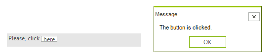

# Creating custom blocks

## 

The RadTextBoxControl allows not only appearance customizations via the formatting event,
        	but also a replacement of the default UI block representation.
        	The __CreateTextBlock__ event exposes this possibility.
        

You should create a custom text block that inherits from __ITextBlock__ and any inheritor 
        	of RadElement. Let’s create a button text block that should be created for each occurrence of the string here:
        

First, you should create a button that implements __ITextBlock__ interface:

#### __[C#]__

{{region customTextBlock}}
	        public class ButtonTextBlock : RadButtonElement, ITextBlock
	        {
	            private int index;
	            private int offset;
	
	            public ButtonTextBlock()
	            {
	                this.index = 0;
	                this.offset = 0;
	                this.MaxSize = new Size(0, 12);
	            }
	
	            protected override Type ThemeEffectiveType
	            {
	                get
	                {
	                    return typeof(RadButtonElement);
	                }
	            }
	
	            public int Index
	            {
	                get { return this.index; }
	                set { this.index = value; }
	            }
	
	            public int Length
	            {
	                get { return 1; }
	            }
	
	            public int Offset
	            {
	                get { return this.offset; }
	                set { this.offset = value; }
	            }
	
	            public int GetCharacterIndexFromX(float x)
	            {
	                RectangleF bounds = this.ControlBoundingRectangle;
	                float median = bounds.X + bounds.Width / 2;
	                return x <= median ? 0 : 1;
	            }
	
	            public RectangleF GetRectangleFromCharacterIndex(int index, bool trailEdge)
	            {
	                Rectangle bounds = this.ControlBoundingRectangle;
	
	                if (index == 1)
	                {
	                    bounds.X = bounds.Right;
	                    bounds.Width = 0;
	                }
	
	                return bounds;
	            }
	
	            protected override void OnClick(EventArgs e)
	            {
	                base.OnClick(e);
	                RadMessageBox.Show("The button is clicked.", "Message");
	            }
	        }
	{{endregion}}

#### __[VB.NET]__

{{region customTextBlock}}
	    Public Class ButtonTextBlock
	        Inherits RadButtonElement
	        Implements ITextBlock
	        Private m_index As Integer
	        Private m_offset As Integer
	
	        Public Sub New()
	            Me.m_index = 0
	            Me.m_offset = 0
	            Me.MaxSize = New Size(0, 12)
	        End Sub
	
	        Protected Overrides ReadOnly Property ThemeEffectiveType() As Type
	            Get
	                Return GetType(RadButtonElement)
	            End Get
	        End Property
	
	        Public Property Index() As Integer Implements ITextBlock.Index
	            Get
	                Return Me.m_index
	            End Get
	            Set(value As Integer)
	                Me.m_index = value
	            End Set
	        End Property
	
	        Public ReadOnly Property Length() As Integer Implements ITextBlock.Length
	            Get
	                Return 1
	            End Get
	        End Property
	
	        Public Property Offset() As Integer Implements ITextBlock.Offset
	            Get
	                Return Me.m_offset
	            End Get
	            Set(value As Integer)
	                Me.m_offset = value
	            End Set
	        End Property
	
	        Public Function GetCharacterIndexFromX(x As Single) As Integer Implements ITextBlock.GetCharacterIndexFromX
	            Dim bounds As RectangleF = Me.ControlBoundingRectangle
	            Dim median As Single = bounds.X + bounds.Width / 2
	            Return If(x <= median, 0, 1)
	        End Function
	
	        Public Function GetRectangleFromCharacterIndex(index As Integer, trailEdge As Boolean) As RectangleF Implements ITextBlock.GetRectangleFromCharacterIndex
	            Dim bounds As Rectangle = Me.ControlBoundingRectangle
	
	            If index = 1 Then
	                bounds.X = bounds.Right
	                bounds.Width = 0
	            End If
	
	            Return bounds
	        End Function
	
	        Protected Overrides Sub OnClick(e As EventArgs)
	            MyBase.OnClick(e)
	            RadMessageBox.Show("The button is clicked.", "Message")
	        End Sub
	
	        Overloads Sub Measure(availableSize As SizeF) Implements ITextBlock.Measure
	            MyBase.Measure(availableSize)
	        End Sub
	
	        Overloads Sub Arrange(finalRectangle As RectangleF) Implements ITextBlock.Arrange
	            MyBase.Arrange(finalRectangle)
	        End Sub
	
	        Overloads ReadOnly Property DesiredSize As SizeF Implements ITextBlock.DesiredSize
	            Get
	                Return MyBase.DesiredSize
	            End Get
	        End Property
	
	        Overloads ReadOnly Property ControlBoundingRectangle As Rectangle Implements ITextBlock.ControlBoundingRectangle
	            Get
	                Return MyBase.ControlBoundingRectangle
	            End Get
	        End Property
	
	        Overloads Property Text As String Implements ITextBlock.Text
	            Get
	                Return MyBase.Text
	            End Get
	            Set(value As String)
	                MyBase.Text = value
	            End Set
	        End Property
	    End Class
	#End Region
	End Class

Then you should subscribe to the __CreateTextBlock__ event
			before initializing the __Text__ property of RadTextBoxControl:
		

#### __[C#]__

{{region applyCustomTextBlock1}}
	            radTextBoxControl1.CreateTextBlock += new CreateTextBlockEventHandler(radTextBoxControl1_CreateTextBlock);
	{{endregion}}

#### __[C#]__

{{region applyCustomTextBlock2}}
	        void radTextBoxControl1_CreateTextBlock(object sender, CreateTextBlockEventArgs e)
	        {
	            if (e.Text == "here")
	            {
	                e.TextBlock = new ButtonTextBlock();
	            }
	        }
	{{endregion}}

#### __[VB.NET]__

{{region applyCustomTextBlock1}}
	        AddHandler RadTextBoxControl1.CreateTextBlock, AddressOf radTextBoxControl1_CreateTextBlock
	        '#End Region
	    End Sub
	
	#Region "applyCustomTextBlock2"
	    Private Sub radTextBoxControl1_CreateTextBlock(sender As Object, e As CreateTextBlockEventArgs)
	        If e.Text = "here" Then
	            e.TextBlock = New ButtonTextBlock()
	        End If
	    End Sub
	#End Region
	    Private Sub setTheText()
	        '#Region "applyCustomTextBlock3"
	        Me.RadTextBoxControl1.Text = "Please, click here"
	        '#End Region
	    End Sub
	
	
	#Region "customTextBlock"
	    Public Class ButtonTextBlock
	        Inherits RadButtonElement
	        Implements ITextBlock
	        Private m_index As Integer
	        Private m_offset As Integer
	
	        Public Sub New()
	            Me.m_index = 0
	            Me.m_offset = 0
	            Me.MaxSize = New Size(0, 12)
	        End Sub
	
	        Protected Overrides ReadOnly Property ThemeEffectiveType() As Type
	            Get
	                Return GetType(RadButtonElement)
	            End Get
	        End Property
	
	        Public Property Index() As Integer Implements ITextBlock.Index
	            Get
	                Return Me.m_index
	            End Get
	            Set(value As Integer)
	                Me.m_index = value
	            End Set
	        End Property
	
	        Public ReadOnly Property Length() As Integer Implements ITextBlock.Length
	            Get
	                Return 1
	            End Get
	        End Property
	
	        Public Property Offset() As Integer Implements ITextBlock.Offset
	            Get
	                Return Me.m_offset
	            End Get
	            Set(value As Integer)
	                Me.m_offset = value
	            End Set
	        End Property
	
	        Public Function GetCharacterIndexFromX(x As Single) As Integer Implements ITextBlock.GetCharacterIndexFromX
	            Dim bounds As RectangleF = Me.ControlBoundingRectangle
	            Dim median As Single = bounds.X + bounds.Width / 2
	            Return If(x <= median, 0, 1)
	        End Function
	
	        Public Function GetRectangleFromCharacterIndex(index As Integer, trailEdge As Boolean) As RectangleF Implements ITextBlock.GetRectangleFromCharacterIndex
	            Dim bounds As Rectangle = Me.ControlBoundingRectangle
	
	            If index = 1 Then
	                bounds.X = bounds.Right
	                bounds.Width = 0
	            End If
	
	            Return bounds
	        End Function
	
	        Protected Overrides Sub OnClick(e As EventArgs)
	            MyBase.OnClick(e)
	            RadMessageBox.Show("The button is clicked.", "Message")
	        End Sub
	
	        Overloads Sub Measure(availableSize As SizeF) Implements ITextBlock.Measure
	            MyBase.Measure(availableSize)
	        End Sub
	
	        Overloads Sub Arrange(finalRectangle As RectangleF) Implements ITextBlock.Arrange
	            MyBase.Arrange(finalRectangle)
	        End Sub
	
	        Overloads ReadOnly Property DesiredSize As SizeF Implements ITextBlock.DesiredSize
	            Get
	                Return MyBase.DesiredSize
	            End Get
	        End Property
	
	        Overloads ReadOnly Property ControlBoundingRectangle As Rectangle Implements ITextBlock.ControlBoundingRectangle
	            Get
	                Return MyBase.ControlBoundingRectangle
	            End Get
	        End Property
	
	        Overloads Property Text As String Implements ITextBlock.Text
	            Get
	                Return MyBase.Text
	            End Get
	            Set(value As String)
	                MyBase.Text = value
	            End Set
	        End Property
	    End Class
	#End Region
	End Class

#### __[VB.NET]__

{{region applyCustomTextBlock2}}
	    Private Sub radTextBoxControl1_CreateTextBlock(sender As Object, e As CreateTextBlockEventArgs)
	        If e.Text = "here" Then
	            e.TextBlock = New ButtonTextBlock()
	        End If
	    End Sub
	#End Region
	    Private Sub setTheText()
	        '#Region "applyCustomTextBlock3"
	        Me.RadTextBoxControl1.Text = "Please, click here"
	        '#End Region
	    End Sub
	
	
	#Region "customTextBlock"
	    Public Class ButtonTextBlock
	        Inherits RadButtonElement
	        Implements ITextBlock
	        Private m_index As Integer
	        Private m_offset As Integer
	
	        Public Sub New()
	            Me.m_index = 0
	            Me.m_offset = 0
	            Me.MaxSize = New Size(0, 12)
	        End Sub
	
	        Protected Overrides ReadOnly Property ThemeEffectiveType() As Type
	            Get
	                Return GetType(RadButtonElement)
	            End Get
	        End Property
	
	        Public Property Index() As Integer Implements ITextBlock.Index
	            Get
	                Return Me.m_index
	            End Get
	            Set(value As Integer)
	                Me.m_index = value
	            End Set
	        End Property
	
	        Public ReadOnly Property Length() As Integer Implements ITextBlock.Length
	            Get
	                Return 1
	            End Get
	        End Property
	
	        Public Property Offset() As Integer Implements ITextBlock.Offset
	            Get
	                Return Me.m_offset
	            End Get
	            Set(value As Integer)
	                Me.m_offset = value
	            End Set
	        End Property
	
	        Public Function GetCharacterIndexFromX(x As Single) As Integer Implements ITextBlock.GetCharacterIndexFromX
	            Dim bounds As RectangleF = Me.ControlBoundingRectangle
	            Dim median As Single = bounds.X + bounds.Width / 2
	            Return If(x <= median, 0, 1)
	        End Function
	
	        Public Function GetRectangleFromCharacterIndex(index As Integer, trailEdge As Boolean) As RectangleF Implements ITextBlock.GetRectangleFromCharacterIndex
	            Dim bounds As Rectangle = Me.ControlBoundingRectangle
	
	            If index = 1 Then
	                bounds.X = bounds.Right
	                bounds.Width = 0
	            End If
	
	            Return bounds
	        End Function
	
	        Protected Overrides Sub OnClick(e As EventArgs)
	            MyBase.OnClick(e)
	            RadMessageBox.Show("The button is clicked.", "Message")
	        End Sub
	
	        Overloads Sub Measure(availableSize As SizeF) Implements ITextBlock.Measure
	            MyBase.Measure(availableSize)
	        End Sub
	
	        Overloads Sub Arrange(finalRectangle As RectangleF) Implements ITextBlock.Arrange
	            MyBase.Arrange(finalRectangle)
	        End Sub
	
	        Overloads ReadOnly Property DesiredSize As SizeF Implements ITextBlock.DesiredSize
	            Get
	                Return MyBase.DesiredSize
	            End Get
	        End Property
	
	        Overloads ReadOnly Property ControlBoundingRectangle As Rectangle Implements ITextBlock.ControlBoundingRectangle
	            Get
	                Return MyBase.ControlBoundingRectangle
	            End Get
	        End Property
	
	        Overloads Property Text As String Implements ITextBlock.Text
	            Get
	                Return MyBase.Text
	            End Get
	            Set(value As String)
	                MyBase.Text = value
	            End Set
	        End Property
	    End Class
	#End Region
	End Class

Finally, the text property should be set:

#### __[C#]__

{{region applyCustomTextBlock3}}
	            this.radTextBoxControl1.Text = "Please, click here";
	{{endregion}}

#### __[VB.NET]__

{{region applyCustomTextBlock3}}
	        Me.RadTextBoxControl1.Text = "Please, click here"
	        '#End Region
	    End Sub
	
	
	#Region "customTextBlock"
	    Public Class ButtonTextBlock
	        Inherits RadButtonElement
	        Implements ITextBlock
	        Private m_index As Integer
	        Private m_offset As Integer
	
	        Public Sub New()
	            Me.m_index = 0
	            Me.m_offset = 0
	            Me.MaxSize = New Size(0, 12)
	        End Sub
	
	        Protected Overrides ReadOnly Property ThemeEffectiveType() As Type
	            Get
	                Return GetType(RadButtonElement)
	            End Get
	        End Property
	
	        Public Property Index() As Integer Implements ITextBlock.Index
	            Get
	                Return Me.m_index
	            End Get
	            Set(value As Integer)
	                Me.m_index = value
	            End Set
	        End Property
	
	        Public ReadOnly Property Length() As Integer Implements ITextBlock.Length
	            Get
	                Return 1
	            End Get
	        End Property
	
	        Public Property Offset() As Integer Implements ITextBlock.Offset
	            Get
	                Return Me.m_offset
	            End Get
	            Set(value As Integer)
	                Me.m_offset = value
	            End Set
	        End Property
	
	        Public Function GetCharacterIndexFromX(x As Single) As Integer Implements ITextBlock.GetCharacterIndexFromX
	            Dim bounds As RectangleF = Me.ControlBoundingRectangle
	            Dim median As Single = bounds.X + bounds.Width / 2
	            Return If(x <= median, 0, 1)
	        End Function
	
	        Public Function GetRectangleFromCharacterIndex(index As Integer, trailEdge As Boolean) As RectangleF Implements ITextBlock.GetRectangleFromCharacterIndex
	            Dim bounds As Rectangle = Me.ControlBoundingRectangle
	
	            If index = 1 Then
	                bounds.X = bounds.Right
	                bounds.Width = 0
	            End If
	
	            Return bounds
	        End Function
	
	        Protected Overrides Sub OnClick(e As EventArgs)
	            MyBase.OnClick(e)
	            RadMessageBox.Show("The button is clicked.", "Message")
	        End Sub
	
	        Overloads Sub Measure(availableSize As SizeF) Implements ITextBlock.Measure
	            MyBase.Measure(availableSize)
	        End Sub
	
	        Overloads Sub Arrange(finalRectangle As RectangleF) Implements ITextBlock.Arrange
	            MyBase.Arrange(finalRectangle)
	        End Sub
	
	        Overloads ReadOnly Property DesiredSize As SizeF Implements ITextBlock.DesiredSize
	            Get
	                Return MyBase.DesiredSize
	            End Get
	        End Property
	
	        Overloads ReadOnly Property ControlBoundingRectangle As Rectangle Implements ITextBlock.ControlBoundingRectangle
	            Get
	                Return MyBase.ControlBoundingRectangle
	            End Get
	        End Property
	
	        Overloads Property Text As String Implements ITextBlock.Text
	            Get
	                Return MyBase.Text
	            End Get
	            Set(value As String)
	                MyBase.Text = value
	            End Set
	        End Property
	    End Class
	#End Region
	End Class

