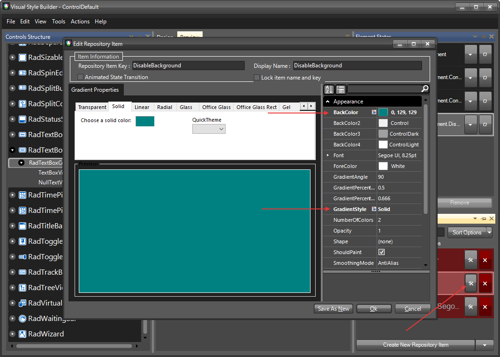
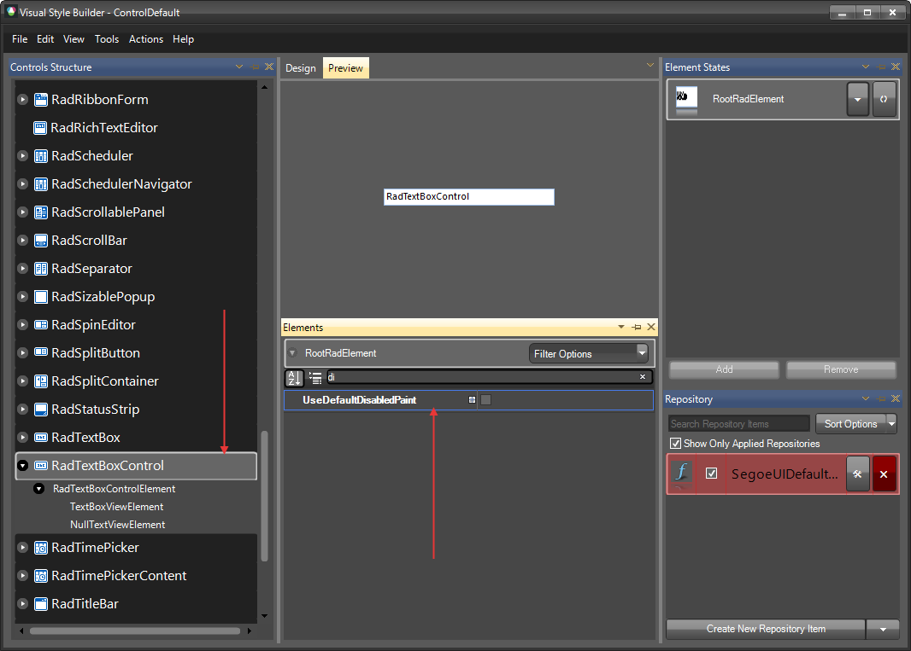

# Themes

This help article will demonstrate a step by step tutorial how to customize the `ControlDefault` theme for __RadTextBoxControl__.

1. Open [Visual Style Builder] ()
2. Export the built-in themes in a specific folder by selecting `File` >> `Export Built-in Themes`.
3. Load a desired theme from the just exported files by selecting `File` >> `Open Package`.
4. Expand __RadTextBoxControl__ and select  `RadTextBoxControlElement` and the select the __Disabled__ state in the `Element States` window. 
    

5. Open the `Edit Repository Item` dialog and change the `BackColor` and the `GradientStyle`:
   

6. Select `RadTextBoxControl` and change the __UseDefaultDisabledPaint__ property to *false*.
   

7. Go back to RadTextBoxControlElement and change the __UseDefaultDisabledPaint__ for it as well.
   

>tip The following article shows how you can use the new theme: [Using Custom Themes]().

# See Also 

* [Customizing Appearance]()
* [Formatting]()