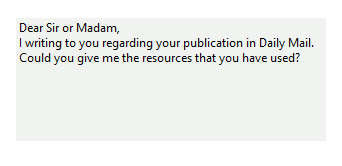

# Getting Started

## 

The RadTextBoxControl is used to get input from the user or to display text.
          The control can display multiple lines, wrap text to the size of the control,
          add basic formatting, use themes, and the main differences with RadTextBox -
          can be transparent and use gradients. The text box control provides a single format
          style for the text displayed or entered.
        

The text displayed by the control resides in the Text property. It can be set at
          design time via the Properties window in Visual Studio, at run time in code,
          or by user input at run time. The current contents of a text box can be retrieved at
          run time by via the Text property.
        

The code below sets text in the control at run time:

#### __[C#] __

{{region SetText}}
	        private void SetDefaultText()
	        {
	            this.radTextBoxControl1.Text = "Type your name here.";
	        }
	{{endregion}}

#### __[VB.NET] __

{{region SetText}}
	    Private Sub SetDefaultText()
	        Me.RadTextBoxControl1.Text = "Type your name here."
	    End Sub
	#End Region
	
	#Region "Lines"
	    Private Sub SetLines()
	        Dim lines As String() = New String() {"Dear Sir or Madam,", "I writing to you regarding your publication in Daily Mail.", "Could you give me the resources that you have used?"}
	        Me.RadTextBoxControl1.Lines = lines
	    End Sub
	#End Region
	
	#Region "SetNullText"
	    Private Sub SetNullText()
	        Me.RadTextBoxControl1.NullText = "Type your name..."
	    End Sub
	#End Region
	
	#Region "SetTextAlign"
	    Private Sub SetTextAlign()
	        Me.RadTextBoxControl1.TextAlign = HorizontalAlignment.Left
	    End Sub
	#End Region
	
	#Region "SetSelection"
	    Private Sub SetSelection()
	        Me.RadTextBoxControl1.Text = "Hello, John Green"
	        Me.RadTextBoxControl1.SelectionStart = 7
	        Me.RadTextBoxControl1.SelectionLength = 4
	    End Sub
	#End Region
	
	#Region "Select"
	    Private Sub SelectText()
	        Me.RadTextBoxControl1.Text = "Hello, John Green"
	        Me.RadTextBoxControl1.[Select](7, 4)
	    End Sub
	#End Region
	
	#Region "Insert"
	    Private Sub Insert()
	        Me.RadTextBoxControl1.Text = "Green"
	        Me.RadTextBoxControl1.CaretIndex = 0
	        Me.RadTextBoxControl1.Insert("John ")
	    End Sub
	#End Region
	
	#Region "AppendText"
	    Private Sub AppendText()
	        Me.RadTextBoxControl1.Text = "Samuel"
	        Me.RadTextBoxControl1.AppendText(" Jackson")
	    End Sub
	#End Region
	
	#Region "Delete"
	    Private Sub DeleteSelection()
	        Me.RadTextBoxControl1.Text = "John Green"
	        Me.RadTextBoxControl1.[Select](0, 4)
	        Me.RadTextBoxControl1.Delete()
	    End Sub
	#End Region
	
	#Region "TextChanging"
	    Private Sub radTextBoxControl1_TextChanging(sender As Object, e As Telerik.WinControls.TextChangingEventArgs)
	        e.Cancel = String.IsNullOrEmpty(e.NewValue)
	    End Sub
	#End Region
	
	#Region "AddAutoCompleteItems"
	    Private Sub AddAutoCompleteItems()
	        Me.RadTextBoxControl1.AutoCompleteMode = AutoCompleteMode.Suggest
	        Dim autoCompleteItems As RadListDataItemCollection = Me.RadTextBoxControl1.AutoCompleteItems
	
	        autoCompleteItems.Add(New RadListDataItem("Luke"))
	        autoCompleteItems.Add(New RadListDataItem("Max"))
	        autoCompleteItems.Add(New RadListDataItem("Adam"))
	        autoCompleteItems.Add(New RadListDataItem("Henry"))
	        autoCompleteItems.Add(New RadListDataItem("Jack"))
	        autoCompleteItems.Add(New RadListDataItem("Ben"))
	        autoCompleteItems.Add(New RadListDataItem("Tyler"))
	        autoCompleteItems.Add(New RadListDataItem("Ethan"))
	        autoCompleteItems.Add(New RadListDataItem("David"))
	        autoCompleteItems.Add(New RadListDataItem("Mike"))
	    End Sub
	#End Region
	
	    Private Sub formatting1()
	        '#Region "Formatting1"
	        AddHandler Me.RadTextBoxControl1.TextBlockFormatting, AddressOf Me.OnTextBlockFormatting
	        Me.RadTextBoxControl1.Text = "This is important text."
	        '#End Region
	    End Sub
	
	#Region "formatting2"
	    Private Sub OnTextBlockFormatting(sender As Object, e As Telerik.WinControls.UI.TextBlockFormattingEventArgs)
	        Dim textBlock As TextBlockElement = TryCast(e.TextBlock, TextBlockElement)
	
	        If textBlock IsNot Nothing AndAlso e.TextBlock.Text = "important" Then
	            textBlock.ForeColor = Color.Red
	        End If
	    End Sub
	#End Region
	
	    Private Sub applyCustomTextBlock1()
	        '#Region "applyCustomTextBlock1"
	        AddHandler RadTextBoxControl1.CreateTextBlock, AddressOf radTextBoxControl1_CreateTextBlock
	        '#End Region
	    End Sub
	
	#Region "applyCustomTextBlock2"
	    Private Sub radTextBoxControl1_CreateTextBlock(sender As Object, e As CreateTextBlockEventArgs)
	        If e.Text = "here" Then
	            e.TextBlock = New ButtonTextBlock()
	        End If
	    End Sub
	#End Region
	    Private Sub setTheText()
	        '#Region "applyCustomTextBlock3"
	        Me.RadTextBoxControl1.Text = "Please, click here"
	        '#End Region
	    End Sub
	
	
	#Region "customTextBlock"
	    Public Class ButtonTextBlock
	        Inherits RadButtonElement
	        Implements ITextBlock
	        Private m_index As Integer
	        Private m_offset As Integer
	
	        Public Sub New()
	            Me.m_index = 0
	            Me.m_offset = 0
	            Me.MaxSize = New Size(0, 12)
	        End Sub
	
	        Protected Overrides ReadOnly Property ThemeEffectiveType() As Type
	            Get
	                Return GetType(RadButtonElement)
	            End Get
	        End Property
	
	        Public Property Index() As Integer Implements ITextBlock.Index
	            Get
	                Return Me.m_index
	            End Get
	            Set(value As Integer)
	                Me.m_index = value
	            End Set
	        End Property
	
	        Public ReadOnly Property Length() As Integer Implements ITextBlock.Length
	            Get
	                Return 1
	            End Get
	        End Property
	
	        Public Property Offset() As Integer Implements ITextBlock.Offset
	            Get
	                Return Me.m_offset
	            End Get
	            Set(value As Integer)
	                Me.m_offset = value
	            End Set
	        End Property
	
	        Public Function GetCharacterIndexFromX(x As Single) As Integer Implements ITextBlock.GetCharacterIndexFromX
	            Dim bounds As RectangleF = Me.ControlBoundingRectangle
	            Dim median As Single = bounds.X + bounds.Width / 2
	            Return If(x <= median, 0, 1)
	        End Function
	
	        Public Function GetRectangleFromCharacterIndex(index As Integer, trailEdge As Boolean) As RectangleF Implements ITextBlock.GetRectangleFromCharacterIndex
	            Dim bounds As Rectangle = Me.ControlBoundingRectangle
	
	            If index = 1 Then
	                bounds.X = bounds.Right
	                bounds.Width = 0
	            End If
	
	            Return bounds
	        End Function
	
	        Protected Overrides Sub OnClick(e As EventArgs)
	            MyBase.OnClick(e)
	            RadMessageBox.Show("The button is clicked.", "Message")
	        End Sub
	
	        Overloads Sub Measure(availableSize As SizeF) Implements ITextBlock.Measure
	            MyBase.Measure(availableSize)
	        End Sub
	
	        Overloads Sub Arrange(finalRectangle As RectangleF) Implements ITextBlock.Arrange
	            MyBase.Arrange(finalRectangle)
	        End Sub
	
	        Overloads ReadOnly Property DesiredSize As SizeF Implements ITextBlock.DesiredSize
	            Get
	                Return MyBase.DesiredSize
	            End Get
	        End Property
	
	        Overloads ReadOnly Property ControlBoundingRectangle As Rectangle Implements ITextBlock.ControlBoundingRectangle
	            Get
	                Return MyBase.ControlBoundingRectangle
	            End Get
	        End Property
	
	        Overloads Property Text As String Implements ITextBlock.Text
	            Get
	                Return MyBase.Text
	            End Get
	            Set(value As String)
	                MyBase.Text = value
	            End Set
	        End Property
	    End Class
	#End Region
	End Class

You can also define the lines in the text box at run time:

#### __[C#] __

{{region Lines}}
	        private void SetLines()
	        {
	            string[] lines = new string[]
	            {
	                "Dear Sir or Madam,",
	                "I writing to you regarding your publication in Daily Mail.",
	                "Could you give me the resources that you have used?"
	            };
	            this.radTextBoxControl1.Lines = lines;
	        }
	{{endregion}}

#### __[VB.NET] __

{{region Lines}}
	    Private Sub SetLines()
	        Dim lines As String() = New String() {"Dear Sir or Madam,", "I writing to you regarding your publication in Daily Mail.", "Could you give me the resources that you have used?"}
	        Me.RadTextBoxControl1.Lines = lines
	    End Sub
	#End Region
	
	#Region "SetNullText"
	    Private Sub SetNullText()
	        Me.RadTextBoxControl1.NullText = "Type your name..."
	    End Sub
	#End Region
	
	#Region "SetTextAlign"
	    Private Sub SetTextAlign()
	        Me.RadTextBoxControl1.TextAlign = HorizontalAlignment.Left
	    End Sub
	#End Region
	
	#Region "SetSelection"
	    Private Sub SetSelection()
	        Me.RadTextBoxControl1.Text = "Hello, John Green"
	        Me.RadTextBoxControl1.SelectionStart = 7
	        Me.RadTextBoxControl1.SelectionLength = 4
	    End Sub
	#End Region
	
	#Region "Select"
	    Private Sub SelectText()
	        Me.RadTextBoxControl1.Text = "Hello, John Green"
	        Me.RadTextBoxControl1.[Select](7, 4)
	    End Sub
	#End Region
	
	#Region "Insert"
	    Private Sub Insert()
	        Me.RadTextBoxControl1.Text = "Green"
	        Me.RadTextBoxControl1.CaretIndex = 0
	        Me.RadTextBoxControl1.Insert("John ")
	    End Sub
	#End Region
	
	#Region "AppendText"
	    Private Sub AppendText()
	        Me.RadTextBoxControl1.Text = "Samuel"
	        Me.RadTextBoxControl1.AppendText(" Jackson")
	    End Sub
	#End Region
	
	#Region "Delete"
	    Private Sub DeleteSelection()
	        Me.RadTextBoxControl1.Text = "John Green"
	        Me.RadTextBoxControl1.[Select](0, 4)
	        Me.RadTextBoxControl1.Delete()
	    End Sub
	#End Region
	
	#Region "TextChanging"
	    Private Sub radTextBoxControl1_TextChanging(sender As Object, e As Telerik.WinControls.TextChangingEventArgs)
	        e.Cancel = String.IsNullOrEmpty(e.NewValue)
	    End Sub
	#End Region
	
	#Region "AddAutoCompleteItems"
	    Private Sub AddAutoCompleteItems()
	        Me.RadTextBoxControl1.AutoCompleteMode = AutoCompleteMode.Suggest
	        Dim autoCompleteItems As RadListDataItemCollection = Me.RadTextBoxControl1.AutoCompleteItems
	
	        autoCompleteItems.Add(New RadListDataItem("Luke"))
	        autoCompleteItems.Add(New RadListDataItem("Max"))
	        autoCompleteItems.Add(New RadListDataItem("Adam"))
	        autoCompleteItems.Add(New RadListDataItem("Henry"))
	        autoCompleteItems.Add(New RadListDataItem("Jack"))
	        autoCompleteItems.Add(New RadListDataItem("Ben"))
	        autoCompleteItems.Add(New RadListDataItem("Tyler"))
	        autoCompleteItems.Add(New RadListDataItem("Ethan"))
	        autoCompleteItems.Add(New RadListDataItem("David"))
	        autoCompleteItems.Add(New RadListDataItem("Mike"))
	    End Sub
	#End Region
	
	    Private Sub formatting1()
	        '#Region "Formatting1"
	        AddHandler Me.RadTextBoxControl1.TextBlockFormatting, AddressOf Me.OnTextBlockFormatting
	        Me.RadTextBoxControl1.Text = "This is important text."
	        '#End Region
	    End Sub
	
	#Region "formatting2"
	    Private Sub OnTextBlockFormatting(sender As Object, e As Telerik.WinControls.UI.TextBlockFormattingEventArgs)
	        Dim textBlock As TextBlockElement = TryCast(e.TextBlock, TextBlockElement)
	
	        If textBlock IsNot Nothing AndAlso e.TextBlock.Text = "important" Then
	            textBlock.ForeColor = Color.Red
	        End If
	    End Sub
	#End Region
	
	    Private Sub applyCustomTextBlock1()
	        '#Region "applyCustomTextBlock1"
	        AddHandler RadTextBoxControl1.CreateTextBlock, AddressOf radTextBoxControl1_CreateTextBlock
	        '#End Region
	    End Sub
	
	#Region "applyCustomTextBlock2"
	    Private Sub radTextBoxControl1_CreateTextBlock(sender As Object, e As CreateTextBlockEventArgs)
	        If e.Text = "here" Then
	            e.TextBlock = New ButtonTextBlock()
	        End If
	    End Sub
	#End Region
	    Private Sub setTheText()
	        '#Region "applyCustomTextBlock3"
	        Me.RadTextBoxControl1.Text = "Please, click here"
	        '#End Region
	    End Sub
	
	
	#Region "customTextBlock"
	    Public Class ButtonTextBlock
	        Inherits RadButtonElement
	        Implements ITextBlock
	        Private m_index As Integer
	        Private m_offset As Integer
	
	        Public Sub New()
	            Me.m_index = 0
	            Me.m_offset = 0
	            Me.MaxSize = New Size(0, 12)
	        End Sub
	
	        Protected Overrides ReadOnly Property ThemeEffectiveType() As Type
	            Get
	                Return GetType(RadButtonElement)
	            End Get
	        End Property
	
	        Public Property Index() As Integer Implements ITextBlock.Index
	            Get
	                Return Me.m_index
	            End Get
	            Set(value As Integer)
	                Me.m_index = value
	            End Set
	        End Property
	
	        Public ReadOnly Property Length() As Integer Implements ITextBlock.Length
	            Get
	                Return 1
	            End Get
	        End Property
	
	        Public Property Offset() As Integer Implements ITextBlock.Offset
	            Get
	                Return Me.m_offset
	            End Get
	            Set(value As Integer)
	                Me.m_offset = value
	            End Set
	        End Property
	
	        Public Function GetCharacterIndexFromX(x As Single) As Integer Implements ITextBlock.GetCharacterIndexFromX
	            Dim bounds As RectangleF = Me.ControlBoundingRectangle
	            Dim median As Single = bounds.X + bounds.Width / 2
	            Return If(x <= median, 0, 1)
	        End Function
	
	        Public Function GetRectangleFromCharacterIndex(index As Integer, trailEdge As Boolean) As RectangleF Implements ITextBlock.GetRectangleFromCharacterIndex
	            Dim bounds As Rectangle = Me.ControlBoundingRectangle
	
	            If index = 1 Then
	                bounds.X = bounds.Right
	                bounds.Width = 0
	            End If
	
	            Return bounds
	        End Function
	
	        Protected Overrides Sub OnClick(e As EventArgs)
	            MyBase.OnClick(e)
	            RadMessageBox.Show("The button is clicked.", "Message")
	        End Sub
	
	        Overloads Sub Measure(availableSize As SizeF) Implements ITextBlock.Measure
	            MyBase.Measure(availableSize)
	        End Sub
	
	        Overloads Sub Arrange(finalRectangle As RectangleF) Implements ITextBlock.Arrange
	            MyBase.Arrange(finalRectangle)
	        End Sub
	
	        Overloads ReadOnly Property DesiredSize As SizeF Implements ITextBlock.DesiredSize
	            Get
	                Return MyBase.DesiredSize
	            End Get
	        End Property
	
	        Overloads ReadOnly Property ControlBoundingRectangle As Rectangle Implements ITextBlock.ControlBoundingRectangle
	            Get
	                Return MyBase.ControlBoundingRectangle
	            End Get
	        End Property
	
	        Overloads Property Text As String Implements ITextBlock.Text
	            Get
	                Return MyBase.Text
	            End Get
	            Set(value As String)
	                MyBase.Text = value
	            End Set
	        End Property
	    End Class
	#End Region
	End Class

By setting the __NullText__ property, the control will display a custom
          string when the __Text__ property is empty or null:
        

#### __[C#] __

{{region SetNullText}}
	        private void SetNullText()
	        {
	            this.radTextBoxControl1.NullText = "Type your name...";
	        }
	{{endregion}}

#### __[VB.NET] __

{{region SetNullText}}
	    Private Sub SetNullText()
	        Me.RadTextBoxControl1.NullText = "Type your name..."
	    End Sub
	#End Region
	
	#Region "SetTextAlign"
	    Private Sub SetTextAlign()
	        Me.RadTextBoxControl1.TextAlign = HorizontalAlignment.Left
	    End Sub
	#End Region
	
	#Region "SetSelection"
	    Private Sub SetSelection()
	        Me.RadTextBoxControl1.Text = "Hello, John Green"
	        Me.RadTextBoxControl1.SelectionStart = 7
	        Me.RadTextBoxControl1.SelectionLength = 4
	    End Sub
	#End Region
	
	#Region "Select"
	    Private Sub SelectText()
	        Me.RadTextBoxControl1.Text = "Hello, John Green"
	        Me.RadTextBoxControl1.[Select](7, 4)
	    End Sub
	#End Region
	
	#Region "Insert"
	    Private Sub Insert()
	        Me.RadTextBoxControl1.Text = "Green"
	        Me.RadTextBoxControl1.CaretIndex = 0
	        Me.RadTextBoxControl1.Insert("John ")
	    End Sub
	#End Region
	
	#Region "AppendText"
	    Private Sub AppendText()
	        Me.RadTextBoxControl1.Text = "Samuel"
	        Me.RadTextBoxControl1.AppendText(" Jackson")
	    End Sub
	#End Region
	
	#Region "Delete"
	    Private Sub DeleteSelection()
	        Me.RadTextBoxControl1.Text = "John Green"
	        Me.RadTextBoxControl1.[Select](0, 4)
	        Me.RadTextBoxControl1.Delete()
	    End Sub
	#End Region
	
	#Region "TextChanging"
	    Private Sub radTextBoxControl1_TextChanging(sender As Object, e As Telerik.WinControls.TextChangingEventArgs)
	        e.Cancel = String.IsNullOrEmpty(e.NewValue)
	    End Sub
	#End Region
	
	#Region "AddAutoCompleteItems"
	    Private Sub AddAutoCompleteItems()
	        Me.RadTextBoxControl1.AutoCompleteMode = AutoCompleteMode.Suggest
	        Dim autoCompleteItems As RadListDataItemCollection = Me.RadTextBoxControl1.AutoCompleteItems
	
	        autoCompleteItems.Add(New RadListDataItem("Luke"))
	        autoCompleteItems.Add(New RadListDataItem("Max"))
	        autoCompleteItems.Add(New RadListDataItem("Adam"))
	        autoCompleteItems.Add(New RadListDataItem("Henry"))
	        autoCompleteItems.Add(New RadListDataItem("Jack"))
	        autoCompleteItems.Add(New RadListDataItem("Ben"))
	        autoCompleteItems.Add(New RadListDataItem("Tyler"))
	        autoCompleteItems.Add(New RadListDataItem("Ethan"))
	        autoCompleteItems.Add(New RadListDataItem("David"))
	        autoCompleteItems.Add(New RadListDataItem("Mike"))
	    End Sub
	#End Region
	
	    Private Sub formatting1()
	        '#Region "Formatting1"
	        AddHandler Me.RadTextBoxControl1.TextBlockFormatting, AddressOf Me.OnTextBlockFormatting
	        Me.RadTextBoxControl1.Text = "This is important text."
	        '#End Region
	    End Sub
	
	#Region "formatting2"
	    Private Sub OnTextBlockFormatting(sender As Object, e As Telerik.WinControls.UI.TextBlockFormattingEventArgs)
	        Dim textBlock As TextBlockElement = TryCast(e.TextBlock, TextBlockElement)
	
	        If textBlock IsNot Nothing AndAlso e.TextBlock.Text = "important" Then
	            textBlock.ForeColor = Color.Red
	        End If
	    End Sub
	#End Region
	
	    Private Sub applyCustomTextBlock1()
	        '#Region "applyCustomTextBlock1"
	        AddHandler RadTextBoxControl1.CreateTextBlock, AddressOf radTextBoxControl1_CreateTextBlock
	        '#End Region
	    End Sub
	
	#Region "applyCustomTextBlock2"
	    Private Sub radTextBoxControl1_CreateTextBlock(sender As Object, e As CreateTextBlockEventArgs)
	        If e.Text = "here" Then
	            e.TextBlock = New ButtonTextBlock()
	        End If
	    End Sub
	#End Region
	    Private Sub setTheText()
	        '#Region "applyCustomTextBlock3"
	        Me.RadTextBoxControl1.Text = "Please, click here"
	        '#End Region
	    End Sub
	
	
	#Region "customTextBlock"
	    Public Class ButtonTextBlock
	        Inherits RadButtonElement
	        Implements ITextBlock
	        Private m_index As Integer
	        Private m_offset As Integer
	
	        Public Sub New()
	            Me.m_index = 0
	            Me.m_offset = 0
	            Me.MaxSize = New Size(0, 12)
	        End Sub
	
	        Protected Overrides ReadOnly Property ThemeEffectiveType() As Type
	            Get
	                Return GetType(RadButtonElement)
	            End Get
	        End Property
	
	        Public Property Index() As Integer Implements ITextBlock.Index
	            Get
	                Return Me.m_index
	            End Get
	            Set(value As Integer)
	                Me.m_index = value
	            End Set
	        End Property
	
	        Public ReadOnly Property Length() As Integer Implements ITextBlock.Length
	            Get
	                Return 1
	            End Get
	        End Property
	
	        Public Property Offset() As Integer Implements ITextBlock.Offset
	            Get
	                Return Me.m_offset
	            End Get
	            Set(value As Integer)
	                Me.m_offset = value
	            End Set
	        End Property
	
	        Public Function GetCharacterIndexFromX(x As Single) As Integer Implements ITextBlock.GetCharacterIndexFromX
	            Dim bounds As RectangleF = Me.ControlBoundingRectangle
	            Dim median As Single = bounds.X + bounds.Width / 2
	            Return If(x <= median, 0, 1)
	        End Function
	
	        Public Function GetRectangleFromCharacterIndex(index As Integer, trailEdge As Boolean) As RectangleF Implements ITextBlock.GetRectangleFromCharacterIndex
	            Dim bounds As Rectangle = Me.ControlBoundingRectangle
	
	            If index = 1 Then
	                bounds.X = bounds.Right
	                bounds.Width = 0
	            End If
	
	            Return bounds
	        End Function
	
	        Protected Overrides Sub OnClick(e As EventArgs)
	            MyBase.OnClick(e)
	            RadMessageBox.Show("The button is clicked.", "Message")
	        End Sub
	
	        Overloads Sub Measure(availableSize As SizeF) Implements ITextBlock.Measure
	            MyBase.Measure(availableSize)
	        End Sub
	
	        Overloads Sub Arrange(finalRectangle As RectangleF) Implements ITextBlock.Arrange
	            MyBase.Arrange(finalRectangle)
	        End Sub
	
	        Overloads ReadOnly Property DesiredSize As SizeF Implements ITextBlock.DesiredSize
	            Get
	                Return MyBase.DesiredSize
	            End Get
	        End Property
	
	        Overloads ReadOnly Property ControlBoundingRectangle As Rectangle Implements ITextBlock.ControlBoundingRectangle
	            Get
	                Return MyBase.ControlBoundingRectangle
	            End Get
	        End Property
	
	        Overloads Property Text As String Implements ITextBlock.Text
	            Get
	                Return MyBase.Text
	            End Get
	            Set(value As String)
	                MyBase.Text = value
	            End Set
	        End Property
	    End Class
	#End Region
	End Class

Based on the value set to the __TextAlign__ property, the control will display its conentent aligned to the left, center or right:
        

#### __[C#] __

{{region SetTextAlign}}
	        public void SetTextAlign()
	        {
	            this.radTextBoxControl1.TextAlign = HorizontalAlignment.Left;
	        }
	{{endregion}}

#### __[VB.NET] __

{{region SetTextAlign}}
	    Private Sub SetTextAlign()
	        Me.RadTextBoxControl1.TextAlign = HorizontalAlignment.Left
	    End Sub
	#End Region
	
	#Region "SetSelection"
	    Private Sub SetSelection()
	        Me.RadTextBoxControl1.Text = "Hello, John Green"
	        Me.RadTextBoxControl1.SelectionStart = 7
	        Me.RadTextBoxControl1.SelectionLength = 4
	    End Sub
	#End Region
	
	#Region "Select"
	    Private Sub SelectText()
	        Me.RadTextBoxControl1.Text = "Hello, John Green"
	        Me.RadTextBoxControl1.[Select](7, 4)
	    End Sub
	#End Region
	
	#Region "Insert"
	    Private Sub Insert()
	        Me.RadTextBoxControl1.Text = "Green"
	        Me.RadTextBoxControl1.CaretIndex = 0
	        Me.RadTextBoxControl1.Insert("John ")
	    End Sub
	#End Region
	
	#Region "AppendText"
	    Private Sub AppendText()
	        Me.RadTextBoxControl1.Text = "Samuel"
	        Me.RadTextBoxControl1.AppendText(" Jackson")
	    End Sub
	#End Region
	
	#Region "Delete"
	    Private Sub DeleteSelection()
	        Me.RadTextBoxControl1.Text = "John Green"
	        Me.RadTextBoxControl1.[Select](0, 4)
	        Me.RadTextBoxControl1.Delete()
	    End Sub
	#End Region
	
	#Region "TextChanging"
	    Private Sub radTextBoxControl1_TextChanging(sender As Object, e As Telerik.WinControls.TextChangingEventArgs)
	        e.Cancel = String.IsNullOrEmpty(e.NewValue)
	    End Sub
	#End Region
	
	#Region "AddAutoCompleteItems"
	    Private Sub AddAutoCompleteItems()
	        Me.RadTextBoxControl1.AutoCompleteMode = AutoCompleteMode.Suggest
	        Dim autoCompleteItems As RadListDataItemCollection = Me.RadTextBoxControl1.AutoCompleteItems
	
	        autoCompleteItems.Add(New RadListDataItem("Luke"))
	        autoCompleteItems.Add(New RadListDataItem("Max"))
	        autoCompleteItems.Add(New RadListDataItem("Adam"))
	        autoCompleteItems.Add(New RadListDataItem("Henry"))
	        autoCompleteItems.Add(New RadListDataItem("Jack"))
	        autoCompleteItems.Add(New RadListDataItem("Ben"))
	        autoCompleteItems.Add(New RadListDataItem("Tyler"))
	        autoCompleteItems.Add(New RadListDataItem("Ethan"))
	        autoCompleteItems.Add(New RadListDataItem("David"))
	        autoCompleteItems.Add(New RadListDataItem("Mike"))
	    End Sub
	#End Region
	
	    Private Sub formatting1()
	        '#Region "Formatting1"
	        AddHandler Me.RadTextBoxControl1.TextBlockFormatting, AddressOf Me.OnTextBlockFormatting
	        Me.RadTextBoxControl1.Text = "This is important text."
	        '#End Region
	    End Sub
	
	#Region "formatting2"
	    Private Sub OnTextBlockFormatting(sender As Object, e As Telerik.WinControls.UI.TextBlockFormattingEventArgs)
	        Dim textBlock As TextBlockElement = TryCast(e.TextBlock, TextBlockElement)
	
	        If textBlock IsNot Nothing AndAlso e.TextBlock.Text = "important" Then
	            textBlock.ForeColor = Color.Red
	        End If
	    End Sub
	#End Region
	
	    Private Sub applyCustomTextBlock1()
	        '#Region "applyCustomTextBlock1"
	        AddHandler RadTextBoxControl1.CreateTextBlock, AddressOf radTextBoxControl1_CreateTextBlock
	        '#End Region
	    End Sub
	
	#Region "applyCustomTextBlock2"
	    Private Sub radTextBoxControl1_CreateTextBlock(sender As Object, e As CreateTextBlockEventArgs)
	        If e.Text = "here" Then
	            e.TextBlock = New ButtonTextBlock()
	        End If
	    End Sub
	#End Region
	    Private Sub setTheText()
	        '#Region "applyCustomTextBlock3"
	        Me.RadTextBoxControl1.Text = "Please, click here"
	        '#End Region
	    End Sub
	
	
	#Region "customTextBlock"
	    Public Class ButtonTextBlock
	        Inherits RadButtonElement
	        Implements ITextBlock
	        Private m_index As Integer
	        Private m_offset As Integer
	
	        Public Sub New()
	            Me.m_index = 0
	            Me.m_offset = 0
	            Me.MaxSize = New Size(0, 12)
	        End Sub
	
	        Protected Overrides ReadOnly Property ThemeEffectiveType() As Type
	            Get
	                Return GetType(RadButtonElement)
	            End Get
	        End Property
	
	        Public Property Index() As Integer Implements ITextBlock.Index
	            Get
	                Return Me.m_index
	            End Get
	            Set(value As Integer)
	                Me.m_index = value
	            End Set
	        End Property
	
	        Public ReadOnly Property Length() As Integer Implements ITextBlock.Length
	            Get
	                Return 1
	            End Get
	        End Property
	
	        Public Property Offset() As Integer Implements ITextBlock.Offset
	            Get
	                Return Me.m_offset
	            End Get
	            Set(value As Integer)
	                Me.m_offset = value
	            End Set
	        End Property
	
	        Public Function GetCharacterIndexFromX(x As Single) As Integer Implements ITextBlock.GetCharacterIndexFromX
	            Dim bounds As RectangleF = Me.ControlBoundingRectangle
	            Dim median As Single = bounds.X + bounds.Width / 2
	            Return If(x <= median, 0, 1)
	        End Function
	
	        Public Function GetRectangleFromCharacterIndex(index As Integer, trailEdge As Boolean) As RectangleF Implements ITextBlock.GetRectangleFromCharacterIndex
	            Dim bounds As Rectangle = Me.ControlBoundingRectangle
	
	            If index = 1 Then
	                bounds.X = bounds.Right
	                bounds.Width = 0
	            End If
	
	            Return bounds
	        End Function
	
	        Protected Overrides Sub OnClick(e As EventArgs)
	            MyBase.OnClick(e)
	            RadMessageBox.Show("The button is clicked.", "Message")
	        End Sub
	
	        Overloads Sub Measure(availableSize As SizeF) Implements ITextBlock.Measure
	            MyBase.Measure(availableSize)
	        End Sub
	
	        Overloads Sub Arrange(finalRectangle As RectangleF) Implements ITextBlock.Arrange
	            MyBase.Arrange(finalRectangle)
	        End Sub
	
	        Overloads ReadOnly Property DesiredSize As SizeF Implements ITextBlock.DesiredSize
	            Get
	                Return MyBase.DesiredSize
	            End Get
	        End Property
	
	        Overloads ReadOnly Property ControlBoundingRectangle As Rectangle Implements ITextBlock.ControlBoundingRectangle
	            Get
	                Return MyBase.ControlBoundingRectangle
	            End Get
	        End Property
	
	        Overloads Property Text As String Implements ITextBlock.Text
	            Get
	                Return MyBase.Text
	            End Get
	            Set(value As String)
	                MyBase.Text = value
	            End Set
	        End Property
	    End Class
	#End Region
	End Class

