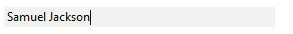

# Text editing

The editing point is determined by the caret position and selection in __RadTextBoxControl__. The editing position is visible only if the control is focused.
        

You can insert text programmatically at concrete position by using the __Insert__ method. At that case, the text is inserted at the position determined by the __SelectionStart__ property. If the __SelectionLength__ property is greater than zero, the inserted text replaces the selected text. 

{{source=..\SamplesCS\Editors\TextBoxControl.cs region=Insert}} 
{{source=..\SamplesVB\Editors\TextBoxControl.vb region=Insert}} 

````C#
private void Insert()
{
    this.radTextBoxControl1.Text = "Green";
    this.radTextBoxControl1.CaretIndex = 0;
    this.radTextBoxControl1.Insert("John ");
}

````
````VB.NET
Private Sub Insert()
    Me.RadTextBoxControl1.Text = "Green"
    Me.RadTextBoxControl1.CaretIndex = 0
    Me.RadTextBoxControl1.Insert("John ")
End Sub

````

{{endregion}} 
 
The code above produces the following result:


Alternatively, you can insert text at the end of the RadTextBoxControl content by using the __AppendText__ method: 

{{source=..\SamplesCS\Editors\TextBoxControl.cs region=AppendText}} 
{{source=..\SamplesVB\Editors\TextBoxControl.vb region=AppendText}} 

````C#
private void AppendText()
{
    this.radTextBoxControl1.Text = "Samuel";
    this.radTextBoxControl1.AppendText(" Jackson");
}

````
````VB.NET
Private Sub AppendText()
    Me.RadTextBoxControl1.Text = "Samuel"
    Me.RadTextBoxControl1.AppendText(" Jackson")
End Sub

````

{{endregion}} 
 

The appended text is inserted at the end:



You can delete the selected text or character at the caret position by using the __Delete__ method: 

{{source=..\SamplesCS\Editors\TextBoxControl.cs region=Delete}} 
{{source=..\SamplesVB\Editors\TextBoxControl.vb region=Delete}} 

````C#
private void DeleteSelection()
{
    this.radTextBoxControl1.Text = "John Green";
    this.radTextBoxControl1.Select(0, 4);
    this.radTextBoxControl1.Delete();
}

````
````VB.NET
Private Sub DeleteSelection()
    Me.RadTextBoxControl1.Text = "John Green"
    Me.RadTextBoxControl1.[Select](0, 4)
    Me.RadTextBoxControl1.Delete()
End Sub

````

{{endregion}} 
 

After the deletion of the first word the text control looks like:


Each editing operation raises the __TextChanging__ and __TextChanged__ events. Notice that you can prevent successful finishing of operation by subscribing to the __TextChanging__ event: 

{{source=..\SamplesCS\Editors\TextBoxControl.cs region=TextChanging}} 
{{source=..\SamplesVB\Editors\TextBoxControl.vb region=TextChanging}} 

````C#
        
private void radTextBoxControl1_TextChanging(object sender, Telerik.WinControls.TextChangingEventArgs e)
{
    e.Cancel = string.IsNullOrEmpty(e.NewValue);
}

````
````VB.NET
Private Sub radTextBoxControl1_TextChanging(sender As Object, e As Telerik.WinControls.TextChangingEventArgs)
    e.Cancel = String.IsNullOrEmpty(e.NewValue)
End Sub

````

{{endregion}} 
 
The code above prevent deleting in RadTextBoxControl.
