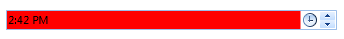
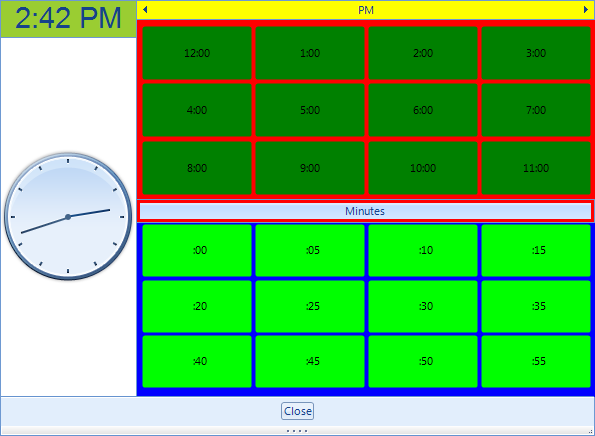
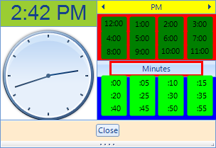

# Customization

Each of the control's elements can be accessed and customized. At the 
      	[Structure, properties and events article]()      
      	, you can find what is the control's structure. Once you access the desired elements,
      	you can tweak its properties in order to modify it. In this tutorial, we will take a look at
      	code snippets, demonstrating how to access and modify different parts of the control:
      

## Customize text box

For example the editable area of the control consist of RadTextBoxItem hosted in RadMaskedEditBoxElement.
        	So in order to customize the text box BackColor you need to set both the BackColor of the RadTextBoxItem 
        	and of the RadMaskedEditBoxElement’s FillPrimitive:
        

#### __[C#]__

{{region CustomizeTextBox}}
	            radTimePicker1.TimePickerElement.MaskedEditBox.Fill.BackColor = Color.Red;
	            radTimePicker1.TimePickerElement.MaskedEditBox.TextBoxItem.BackColor = Color.Red;
	{{endregion}}

#### __[VB.NET]__

{{region CustomizeTextBox}}
	        RadTimePicker1.TimePickerElement.MaskedEditBox.Fill.BackColor = Color.Red
	        RadTimePicker1.TimePickerElement.MaskedEditBox.TextBoxItem.BackColor = Color.Red
	        '#End Region
	
	        '#Region "CustomizeDropDownButton"
	        RadTimePicker1.TimePickerElement.DropDownButton.Padding = New Windows.Forms.Padding(10, 0, 10, 0)
	        '#End Region
	
	        '#Region "CustomizeArrowButtons"
	        RadTimePicker1.TimePickerElement.UpButton.Border.GradientStyle = Telerik.WinControls.GradientStyles.Solid
	        RadTimePicker1.TimePickerElement.UpButton.Border.ForeColor = Color.Blue
	        RadTimePicker1.TimePickerElement.DownButton.Border.GradientStyle = Telerik.WinControls.GradientStyles.Solid
	        RadTimePicker1.TimePickerElement.DownButton.Border.ForeColor = Color.Blue
	        '#End Region
	
	        '#Region "CustomizeClock"
	        'customize header
	        RadTimePicker1.TimePickerElement.PopupContentElement.ClockHeaderElement.Font = New System.Drawing.Font("Arial", 22)
	        RadTimePicker1.TimePickerElement.PopupContentElement.ClockHeaderElement.GradientStyle = Telerik.WinControls.GradientStyles.Solid
	        RadTimePicker1.TimePickerElement.PopupContentElement.ClockHeaderElement.BackColor = Color.YellowGreen
	        'hide seconds arrow
	        RadTimePicker1.TimePickerElement.PopupContentElement.ClockElement.SecondsArrow.Visibility = Telerik.WinControls.ElementVisibility.Collapsed
	        '#End Region
	
	        '#Region "CustomizeHoursAndMinutesHeaders"
	        'hours header
	        RadTimePicker1.TimePickerElement.PopupContentElement.HoursTable.TableHeader.GradientStyle = Telerik.WinControls.GradientStyles.Solid
	        RadTimePicker1.TimePickerElement.PopupContentElement.HoursTable.TableHeader.BackColor = Color.Yellow
	        'minutes header
	        RadTimePicker1.TimePickerElement.PopupContentElement.MinutesTable.TableHeader.HeaderElement.DrawBorder = True
	        RadTimePicker1.TimePickerElement.PopupContentElement.MinutesTable.TableHeader.HeaderElement.BorderWidth = 3
	        RadTimePicker1.TimePickerElement.PopupContentElement.MinutesTable.TableHeader.HeaderElement.BorderColor = Color.Red
	        RadTimePicker1.TimePickerElement.PopupContentElement.MinutesTable.TableHeader.HeaderElement.BorderGradientStyle = Telerik.WinControls.GradientStyles.Solid
	        '#End Region
	
	        '#Region "CustomizeHoursAndMinutesTables"
	        'hours table
	        RadTimePicker1.TimePickerElement.PopupContentElement.HoursTable.DrawFill = True
	        RadTimePicker1.TimePickerElement.PopupContentElement.HoursTable.GradientStyle = Telerik.WinControls.GradientStyles.Solid
	        RadTimePicker1.TimePickerElement.PopupContentElement.HoursTable.BackColor = Color.Red
	        'minutes table
	        RadTimePicker1.TimePickerElement.PopupContentElement.MinutesTable.DrawFill = True
	        RadTimePicker1.TimePickerElement.PopupContentElement.MinutesTable.GradientStyle = Telerik.WinControls.GradientStyles.Solid
	        RadTimePicker1.TimePickerElement.PopupContentElement.MinutesTable.BackColor = Color.Blue
	        '#End Region
	
	        '#Region "CustomizeFooterPanel"
	        RadTimePicker1.TimePickerElement.PopupContentElement.FooterPanel.BackColor = Color.BlanchedAlmond
	        '#End Region
	
	        AddHandler RadTimePicker1.TimeCellFormatting, AddressOf radTimePicker1_TimeCellFormatting
	
	
	        '#region settingTheLocalizationProvider
	        RadTimePickerLocalizationProvider.CurrentProvider = New MyTimePickerLocalizationProvider()
	{{endregion}}

## Customize dropdown button

Here is how you can set some left and right padding of the drop down button:
        

#### __[C#]__

{{region CustomizeDropDownButton}}
	            radTimePicker1.TimePickerElement.DropDownButton.Padding = new Padding(10,0,10,0);
	{{endregion}}

#### __[VB.NET]__

{{region CustomizeDropDownButton}}
	        RadTimePicker1.TimePickerElement.DropDownButton.Padding = New Windows.Forms.Padding(10, 0, 10, 0)
	        '#End Region
	
	        '#Region "CustomizeArrowButtons"
	        RadTimePicker1.TimePickerElement.UpButton.Border.GradientStyle = Telerik.WinControls.GradientStyles.Solid
	        RadTimePicker1.TimePickerElement.UpButton.Border.ForeColor = Color.Blue
	        RadTimePicker1.TimePickerElement.DownButton.Border.GradientStyle = Telerik.WinControls.GradientStyles.Solid
	        RadTimePicker1.TimePickerElement.DownButton.Border.ForeColor = Color.Blue
	        '#End Region
	
	        '#Region "CustomizeClock"
	        'customize header
	        RadTimePicker1.TimePickerElement.PopupContentElement.ClockHeaderElement.Font = New System.Drawing.Font("Arial", 22)
	        RadTimePicker1.TimePickerElement.PopupContentElement.ClockHeaderElement.GradientStyle = Telerik.WinControls.GradientStyles.Solid
	        RadTimePicker1.TimePickerElement.PopupContentElement.ClockHeaderElement.BackColor = Color.YellowGreen
	        'hide seconds arrow
	        RadTimePicker1.TimePickerElement.PopupContentElement.ClockElement.SecondsArrow.Visibility = Telerik.WinControls.ElementVisibility.Collapsed
	        '#End Region
	
	        '#Region "CustomizeHoursAndMinutesHeaders"
	        'hours header
	        RadTimePicker1.TimePickerElement.PopupContentElement.HoursTable.TableHeader.GradientStyle = Telerik.WinControls.GradientStyles.Solid
	        RadTimePicker1.TimePickerElement.PopupContentElement.HoursTable.TableHeader.BackColor = Color.Yellow
	        'minutes header
	        RadTimePicker1.TimePickerElement.PopupContentElement.MinutesTable.TableHeader.HeaderElement.DrawBorder = True
	        RadTimePicker1.TimePickerElement.PopupContentElement.MinutesTable.TableHeader.HeaderElement.BorderWidth = 3
	        RadTimePicker1.TimePickerElement.PopupContentElement.MinutesTable.TableHeader.HeaderElement.BorderColor = Color.Red
	        RadTimePicker1.TimePickerElement.PopupContentElement.MinutesTable.TableHeader.HeaderElement.BorderGradientStyle = Telerik.WinControls.GradientStyles.Solid
	        '#End Region
	
	        '#Region "CustomizeHoursAndMinutesTables"
	        'hours table
	        RadTimePicker1.TimePickerElement.PopupContentElement.HoursTable.DrawFill = True
	        RadTimePicker1.TimePickerElement.PopupContentElement.HoursTable.GradientStyle = Telerik.WinControls.GradientStyles.Solid
	        RadTimePicker1.TimePickerElement.PopupContentElement.HoursTable.BackColor = Color.Red
	        'minutes table
	        RadTimePicker1.TimePickerElement.PopupContentElement.MinutesTable.DrawFill = True
	        RadTimePicker1.TimePickerElement.PopupContentElement.MinutesTable.GradientStyle = Telerik.WinControls.GradientStyles.Solid
	        RadTimePicker1.TimePickerElement.PopupContentElement.MinutesTable.BackColor = Color.Blue
	        '#End Region
	
	        '#Region "CustomizeFooterPanel"
	        RadTimePicker1.TimePickerElement.PopupContentElement.FooterPanel.BackColor = Color.BlanchedAlmond
	        '#End Region
	
	        AddHandler RadTimePicker1.TimeCellFormatting, AddressOf radTimePicker1_TimeCellFormatting
	
	
	        '#region settingTheLocalizationProvider
	        RadTimePickerLocalizationProvider.CurrentProvider = New MyTimePickerLocalizationProvider()
	{{endregion}}

## Customize up/down buttons

Here is how to access and set the border color of the arrow buttons:
        

#### __[C#]__

{{region CustomizeArrowButtons}}
	            radTimePicker1.TimePickerElement.UpButton.Border.GradientStyle = Telerik.WinControls.GradientStyles.Solid;
	            radTimePicker1.TimePickerElement.UpButton.Border.ForeColor = Color.Blue;
	            radTimePicker1.TimePickerElement.DownButton.Border.GradientStyle = Telerik.WinControls.GradientStyles.Solid;
	            radTimePicker1.TimePickerElement.DownButton.Border.ForeColor = Color.Blue;
	{{endregion}}

#### __[VB.NET]__

{{region CustomizeArrowButtons}}
	        RadTimePicker1.TimePickerElement.UpButton.Border.GradientStyle = Telerik.WinControls.GradientStyles.Solid
	        RadTimePicker1.TimePickerElement.UpButton.Border.ForeColor = Color.Blue
	        RadTimePicker1.TimePickerElement.DownButton.Border.GradientStyle = Telerik.WinControls.GradientStyles.Solid
	        RadTimePicker1.TimePickerElement.DownButton.Border.ForeColor = Color.Blue
	        '#End Region
	
	        '#Region "CustomizeClock"
	        'customize header
	        RadTimePicker1.TimePickerElement.PopupContentElement.ClockHeaderElement.Font = New System.Drawing.Font("Arial", 22)
	        RadTimePicker1.TimePickerElement.PopupContentElement.ClockHeaderElement.GradientStyle = Telerik.WinControls.GradientStyles.Solid
	        RadTimePicker1.TimePickerElement.PopupContentElement.ClockHeaderElement.BackColor = Color.YellowGreen
	        'hide seconds arrow
	        RadTimePicker1.TimePickerElement.PopupContentElement.ClockElement.SecondsArrow.Visibility = Telerik.WinControls.ElementVisibility.Collapsed
	        '#End Region
	
	        '#Region "CustomizeHoursAndMinutesHeaders"
	        'hours header
	        RadTimePicker1.TimePickerElement.PopupContentElement.HoursTable.TableHeader.GradientStyle = Telerik.WinControls.GradientStyles.Solid
	        RadTimePicker1.TimePickerElement.PopupContentElement.HoursTable.TableHeader.BackColor = Color.Yellow
	        'minutes header
	        RadTimePicker1.TimePickerElement.PopupContentElement.MinutesTable.TableHeader.HeaderElement.DrawBorder = True
	        RadTimePicker1.TimePickerElement.PopupContentElement.MinutesTable.TableHeader.HeaderElement.BorderWidth = 3
	        RadTimePicker1.TimePickerElement.PopupContentElement.MinutesTable.TableHeader.HeaderElement.BorderColor = Color.Red
	        RadTimePicker1.TimePickerElement.PopupContentElement.MinutesTable.TableHeader.HeaderElement.BorderGradientStyle = Telerik.WinControls.GradientStyles.Solid
	        '#End Region
	
	        '#Region "CustomizeHoursAndMinutesTables"
	        'hours table
	        RadTimePicker1.TimePickerElement.PopupContentElement.HoursTable.DrawFill = True
	        RadTimePicker1.TimePickerElement.PopupContentElement.HoursTable.GradientStyle = Telerik.WinControls.GradientStyles.Solid
	        RadTimePicker1.TimePickerElement.PopupContentElement.HoursTable.BackColor = Color.Red
	        'minutes table
	        RadTimePicker1.TimePickerElement.PopupContentElement.MinutesTable.DrawFill = True
	        RadTimePicker1.TimePickerElement.PopupContentElement.MinutesTable.GradientStyle = Telerik.WinControls.GradientStyles.Solid
	        RadTimePicker1.TimePickerElement.PopupContentElement.MinutesTable.BackColor = Color.Blue
	        '#End Region
	
	        '#Region "CustomizeFooterPanel"
	        RadTimePicker1.TimePickerElement.PopupContentElement.FooterPanel.BackColor = Color.BlanchedAlmond
	        '#End Region
	
	        AddHandler RadTimePicker1.TimeCellFormatting, AddressOf radTimePicker1_TimeCellFormatting
	
	
	        '#region settingTheLocalizationProvider
	        RadTimePickerLocalizationProvider.CurrentProvider = New MyTimePickerLocalizationProvider()
	{{endregion}}

## Customize clock element appearance

Here is how to change the clock header background and font and also how to hide the seconds arrow from the clock:
        

#### __[C#]__

{{region CustomizeClock}}
	            //customize header
	            radTimePicker1.TimePickerElement.PopupContentElement.ClockHeaderElement.Font = new System.Drawing.Font("Arial", 22);
	            radTimePicker1.TimePickerElement.PopupContentElement.ClockHeaderElement.GradientStyle = Telerik.WinControls.GradientStyles.Solid;
	            radTimePicker1.TimePickerElement.PopupContentElement.ClockHeaderElement.BackColor = Color.YellowGreen;
	            //hide seconds arrow
	            radTimePicker1.TimePickerElement.PopupContentElement.ClockElement.SecondsArrow.Visibility = Telerik.WinControls.ElementVisibility.Collapsed;
	{{endregion}}

#### __[VB.NET]__

{{region CustomizeClock}}
	        'customize header
	        RadTimePicker1.TimePickerElement.PopupContentElement.ClockHeaderElement.Font = New System.Drawing.Font("Arial", 22)
	        RadTimePicker1.TimePickerElement.PopupContentElement.ClockHeaderElement.GradientStyle = Telerik.WinControls.GradientStyles.Solid
	        RadTimePicker1.TimePickerElement.PopupContentElement.ClockHeaderElement.BackColor = Color.YellowGreen
	        'hide seconds arrow
	        RadTimePicker1.TimePickerElement.PopupContentElement.ClockElement.SecondsArrow.Visibility = Telerik.WinControls.ElementVisibility.Collapsed
	        '#End Region
	
	        '#Region "CustomizeHoursAndMinutesHeaders"
	        'hours header
	        RadTimePicker1.TimePickerElement.PopupContentElement.HoursTable.TableHeader.GradientStyle = Telerik.WinControls.GradientStyles.Solid
	        RadTimePicker1.TimePickerElement.PopupContentElement.HoursTable.TableHeader.BackColor = Color.Yellow
	        'minutes header
	        RadTimePicker1.TimePickerElement.PopupContentElement.MinutesTable.TableHeader.HeaderElement.DrawBorder = True
	        RadTimePicker1.TimePickerElement.PopupContentElement.MinutesTable.TableHeader.HeaderElement.BorderWidth = 3
	        RadTimePicker1.TimePickerElement.PopupContentElement.MinutesTable.TableHeader.HeaderElement.BorderColor = Color.Red
	        RadTimePicker1.TimePickerElement.PopupContentElement.MinutesTable.TableHeader.HeaderElement.BorderGradientStyle = Telerik.WinControls.GradientStyles.Solid
	        '#End Region
	
	        '#Region "CustomizeHoursAndMinutesTables"
	        'hours table
	        RadTimePicker1.TimePickerElement.PopupContentElement.HoursTable.DrawFill = True
	        RadTimePicker1.TimePickerElement.PopupContentElement.HoursTable.GradientStyle = Telerik.WinControls.GradientStyles.Solid
	        RadTimePicker1.TimePickerElement.PopupContentElement.HoursTable.BackColor = Color.Red
	        'minutes table
	        RadTimePicker1.TimePickerElement.PopupContentElement.MinutesTable.DrawFill = True
	        RadTimePicker1.TimePickerElement.PopupContentElement.MinutesTable.GradientStyle = Telerik.WinControls.GradientStyles.Solid
	        RadTimePicker1.TimePickerElement.PopupContentElement.MinutesTable.BackColor = Color.Blue
	        '#End Region
	
	        '#Region "CustomizeFooterPanel"
	        RadTimePicker1.TimePickerElement.PopupContentElement.FooterPanel.BackColor = Color.BlanchedAlmond
	        '#End Region
	
	        AddHandler RadTimePicker1.TimeCellFormatting, AddressOf radTimePicker1_TimeCellFormatting
	
	
	        '#region settingTheLocalizationProvider
	        RadTimePickerLocalizationProvider.CurrentProvider = New MyTimePickerLocalizationProvider()
	{{endregion}}

## Customize hours and minutes headers

This code snippet demonstrates how to change the hours header back color and the minutes header border appearance:
        

#### __[C#]__

{{region CustomizeHoursAndMinutesHeaders}}
	            //hours header
	            radTimePicker1.TimePickerElement.PopupContentElement.HoursTable.TableHeader.GradientStyle = Telerik.WinControls.GradientStyles.Solid;
	            radTimePicker1.TimePickerElement.PopupContentElement.HoursTable.TableHeader.BackColor = Color.Yellow;
	            //minutes header
	            radTimePicker1.TimePickerElement.PopupContentElement.MinutesTable.TableHeader.HeaderElement.DrawBorder = true;
	            radTimePicker1.TimePickerElement.PopupContentElement.MinutesTable.TableHeader.HeaderElement.BorderWidth = 3;
	            radTimePicker1.TimePickerElement.PopupContentElement.MinutesTable.TableHeader.HeaderElement.BorderColor = Color.Red;
	            radTimePicker1.TimePickerElement.PopupContentElement.MinutesTable.TableHeader.HeaderElement.BorderGradientStyle = Telerik.WinControls.GradientStyles.Solid;
	{{endregion}}

#### __[VB.NET]__

{{region CustomizeHoursAndMinutesHeaders}}
	        'hours header
	        RadTimePicker1.TimePickerElement.PopupContentElement.HoursTable.TableHeader.GradientStyle = Telerik.WinControls.GradientStyles.Solid
	        RadTimePicker1.TimePickerElement.PopupContentElement.HoursTable.TableHeader.BackColor = Color.Yellow
	        'minutes header
	        RadTimePicker1.TimePickerElement.PopupContentElement.MinutesTable.TableHeader.HeaderElement.DrawBorder = True
	        RadTimePicker1.TimePickerElement.PopupContentElement.MinutesTable.TableHeader.HeaderElement.BorderWidth = 3
	        RadTimePicker1.TimePickerElement.PopupContentElement.MinutesTable.TableHeader.HeaderElement.BorderColor = Color.Red
	        RadTimePicker1.TimePickerElement.PopupContentElement.MinutesTable.TableHeader.HeaderElement.BorderGradientStyle = Telerik.WinControls.GradientStyles.Solid
	        '#End Region
	
	        '#Region "CustomizeHoursAndMinutesTables"
	        'hours table
	        RadTimePicker1.TimePickerElement.PopupContentElement.HoursTable.DrawFill = True
	        RadTimePicker1.TimePickerElement.PopupContentElement.HoursTable.GradientStyle = Telerik.WinControls.GradientStyles.Solid
	        RadTimePicker1.TimePickerElement.PopupContentElement.HoursTable.BackColor = Color.Red
	        'minutes table
	        RadTimePicker1.TimePickerElement.PopupContentElement.MinutesTable.DrawFill = True
	        RadTimePicker1.TimePickerElement.PopupContentElement.MinutesTable.GradientStyle = Telerik.WinControls.GradientStyles.Solid
	        RadTimePicker1.TimePickerElement.PopupContentElement.MinutesTable.BackColor = Color.Blue
	        '#End Region
	
	        '#Region "CustomizeFooterPanel"
	        RadTimePicker1.TimePickerElement.PopupContentElement.FooterPanel.BackColor = Color.BlanchedAlmond
	        '#End Region
	
	        AddHandler RadTimePicker1.TimeCellFormatting, AddressOf radTimePicker1_TimeCellFormatting
	
	
	        '#region settingTheLocalizationProvider
	        RadTimePickerLocalizationProvider.CurrentProvider = New MyTimePickerLocalizationProvider()
	{{endregion}}

## Customize hours and minutes cells appearance

The cells in both minutes and hours tables are placed in a GridLayout. To customize the cells, you can use the TimeCellFormatting event of the control:
        

#### __[C#]__

{{region CellFormatting}}
	        void radTimePicker1_TimeCellFormatting(object sender, Telerik.WinControls.UI.TimeCellFormattingEventArgs e)
	        {
	            e.Element.GradientStyle = Telerik.WinControls.GradientStyles.Solid;
	            e.Element.Margin = new Padding(2);
	
	            if (e.IsMinute)
	            {
	                //set minute cells specific properties
	                e.Element.BackColor = Color.Lime;
	            }
	            else
	            {
	                //set hours cells specific properties
	                e.Element.BackColor = Color.Green;
	            }
	        }
	{{endregion}}

#### __[VB.NET]__

{{region CellFormatting}}
	    Private Sub radTimePicker1_TimeCellFormatting(sender As Object, e As Telerik.WinControls.UI.TimeCellFormattingEventArgs)
	        e.Element.GradientStyle = Telerik.WinControls.GradientStyles.Solid
	        e.Element.Margin = New Windows.Forms.Padding(2)
	
	        If e.IsMinute Then
	            'set minute cells specific properties
	            e.Element.BackColor = Color.Lime
	        Else
	            'set hours cells specific properties
	            e.Element.BackColor = Color.Green
	        End If
	    End Sub
	    '#End Region
	
	    '#region LocalizationProvider
	    Class MyTimePickerLocalizationProvider
	        Inherits RadTimePickerLocalizationProvider
	
	        Public Overrides Function GetLocalizedString(id As String) As String
	            Select Case id
	                Case RadTimePickerStringId.HourHeaderText
	                    Return "Hours"
	                Case RadTimePickerStringId.MinutesHeaderText
	                    Return "Minutes"
	                Case RadTimePickerStringId.CloseButtonText
	                    Return "Close"
	                Case Else
	                    Return String.Empty
	            End Select
	        End Function
	
	    End Class
	{{endregion}}

## Customize hours and minutes tables 

This is how you can set the hours and minutes tables background color:
        

#### __[C#]__

{{region CustomizeHoursAndMinutesTables}}
	            //hours table
	            radTimePicker1.TimePickerElement.PopupContentElement.HoursTable.DrawFill = true;
	            radTimePicker1.TimePickerElement.PopupContentElement.HoursTable.GradientStyle = Telerik.WinControls.GradientStyles.Solid;
	            radTimePicker1.TimePickerElement.PopupContentElement.HoursTable.BackColor = Color.Red;
	            //minutes table
	            radTimePicker1.TimePickerElement.PopupContentElement.MinutesTable.DrawFill = true;
	            radTimePicker1.TimePickerElement.PopupContentElement.MinutesTable.GradientStyle = Telerik.WinControls.GradientStyles.Solid;
	            radTimePicker1.TimePickerElement.PopupContentElement.MinutesTable.BackColor = Color.Blue;
	{{endregion}}

#### __[VB.NET]__

{{region CustomizeHoursAndMinutesTables}}
	        'hours table
	        RadTimePicker1.TimePickerElement.PopupContentElement.HoursTable.DrawFill = True
	        RadTimePicker1.TimePickerElement.PopupContentElement.HoursTable.GradientStyle = Telerik.WinControls.GradientStyles.Solid
	        RadTimePicker1.TimePickerElement.PopupContentElement.HoursTable.BackColor = Color.Red
	        'minutes table
	        RadTimePicker1.TimePickerElement.PopupContentElement.MinutesTable.DrawFill = True
	        RadTimePicker1.TimePickerElement.PopupContentElement.MinutesTable.GradientStyle = Telerik.WinControls.GradientStyles.Solid
	        RadTimePicker1.TimePickerElement.PopupContentElement.MinutesTable.BackColor = Color.Blue
	        '#End Region
	
	        '#Region "CustomizeFooterPanel"
	        RadTimePicker1.TimePickerElement.PopupContentElement.FooterPanel.BackColor = Color.BlanchedAlmond
	        '#End Region
	
	        AddHandler RadTimePicker1.TimeCellFormatting, AddressOf radTimePicker1_TimeCellFormatting
	
	
	        '#region settingTheLocalizationProvider
	        RadTimePickerLocalizationProvider.CurrentProvider = New MyTimePickerLocalizationProvider()
	{{endregion}}

## Customize button panel

Here is how to change the BackColor of the FooterPanel:
        

#### __[C#]__

{{region CustomizeFooterPanel}}
	            radTimePicker1.TimePickerElement.PopupContentElement.FooterPanel.BackColor = Color.BlanchedAlmond;
	{{endregion}}

#### __[VB.NET]__

{{region CustomizeFooterPanel}}
	        RadTimePicker1.TimePickerElement.PopupContentElement.FooterPanel.BackColor = Color.BlanchedAlmond
	        '#End Region
	
	        AddHandler RadTimePicker1.TimeCellFormatting, AddressOf radTimePicker1_TimeCellFormatting
	
	
	        '#region settingTheLocalizationProvider
	        RadTimePickerLocalizationProvider.CurrentProvider = New MyTimePickerLocalizationProvider()
	{{endregion}}

