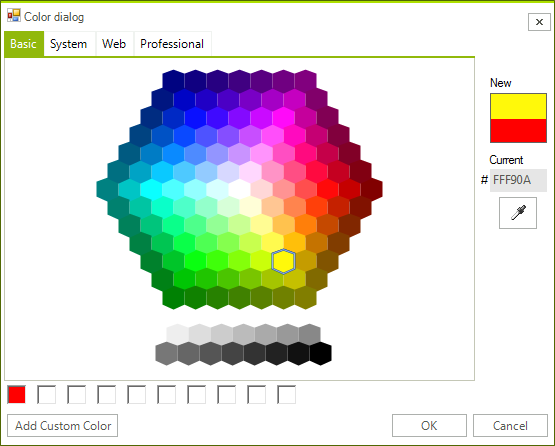
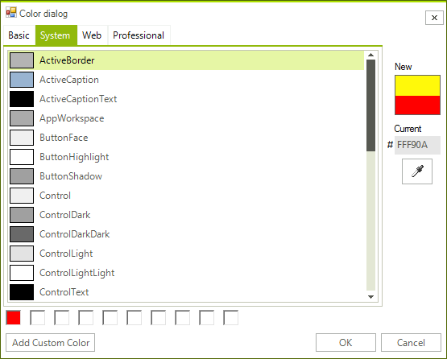
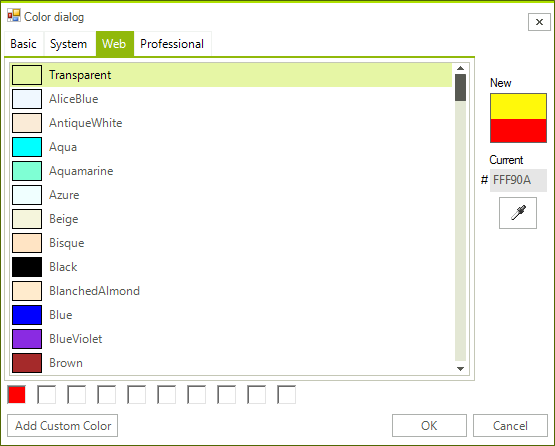
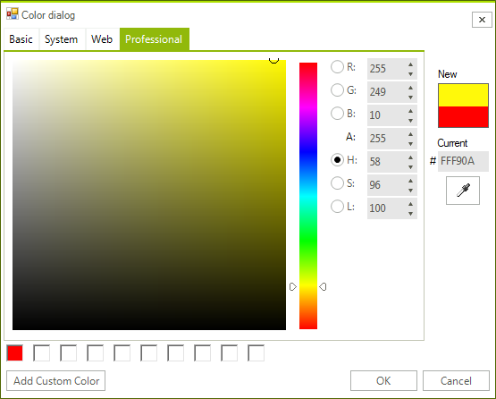
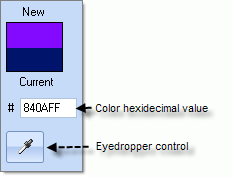
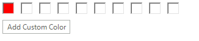

# Usability

## 

The __Color Dialog__ provides multiple ways to select a color using the __Basic__, __System__, __Web__ or __Professional__ color tabs of the dialog. After selecting a color in the dialog, click the __OK__ button to retain your choice or the __Cancel__button to leave the previous color.

* __Basic__ tab lets you choose one a predefined color from a honeycomb interface where you click a colored cell to choose the color. 

* __System__ tab lets you choose one of the __System.Drawing.SystemColors__ enumeration from a list. Each is a color of a Windows display element (i.e. ButtonShadow, ActiveCaptionText, etc). 

* __Web__ tab lets you choose one of the named web colors from a list. 

* __Professional__ tab provides the greatest flexibility in selecting or tailoring the exact color you require. Left click the mouse in the gradient area on the left to select a specific shade of color. Click on the rainbow bar in the middle to select a color. 

The edit areas to the top right of the rainbow bar control __H__ue, __S__aturation and __L__uminance. Hue is represented as a color selected from the rainbow bar. Saturation is the amount of color from 0 to 100 and is represented in the gradient area going from left to right. Luminance can be 0 to 100 and represents the span from black, through the chosen hue to white. 

Under Hue, Saturation and Luminance are the edits for __A__lpha, __R__ed, __G__reen and __B__lue. Alpha represents the amount of transparency the color has where a value of zero would allow anything covered by the color to show through and the maximum value, 255, would completely hide anything covered by the color. R/G/B represent the Red, Green and Blue components of the color using values from 0 to 255.

|||
|||

The right side of each tab includes sample color swatches that show the __Current__ color property when the dialog was invoked and a __New__ color that will be used after the dialog closes. A hexidecimal entry shows the color as a numeric value that can be edited or pasted from another source.  An eye dropper control lets you pick up another color from anywhere on the screen. To use the eye dropper control, click the button and move the mouse over the screen.  Colors under the mouse are reflected in the hexidecimal value and the __New__ color patch. Left-click the mouse to retain a color selected by the eyedropper control.

The bottom area of each tab in the __Color Dialog__ displays a row of slots where selected colors can be saved. Use any of the tabs color selection tools to select a color, including the eye dropper, then click the __Add Custom Color__ button. These custom colors will be retained between invocations of the color dialog.

