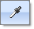
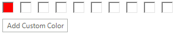

# Working with the RadColorDialog
 
## Properties

The significant properties unique to __RadColorDialog__ are:

__ActiveMode__: Determines the currently selected tab.  Valid enumeration values from __Telerik.WinControls.ColorPickerActiveMode__ are __Basic__, __System__, __Web__, __Professional__.

__AllowColorPickFromScreen__: When true (the default) the "eye dropper" tool is displayed.



__AllowColorSaving__: Toggles the "Add a custom color" button visibility.



__BackColor__: The background color of the color selector as a whole. You can also set this color to be Transparent to have it blend in with your other UI elements.

__ForeColor__: The color for labels and text entry.

__SelectedColor:__ In the figure below the __SelectedColor__ is labeled as "New".

__OldColor:__ In the figure below the __OldColor__ is labeled as "Current".


__ShowBasicColors, ShowSystemColors, ShowWebColors, ShowProfessionalColors__: If true (the default) the corresponding Basic, System, Web and Professional tabs are displayed.

__AllowEditHEXValue:__ If true (the default) enables hexadecimal entry of color values.

__ShowHEXColorValue__: If true (the default) displays the hexadecimal entry of color values.


__CustomColors[]:__ This is a read-only array of Color objects.  You can query the contents of the custom colors displayed along the bottom of the selector.


#### Enlist the current custom colors in RadColorDialog 

{{source=..\SamplesCS\Forms and Dialogs\ColorDialog1.cs region=enlistTheCustomColors}} 
{{source=..\SamplesVB\Forms and Dialogs\ColorDialog1.vb region=enlistTheCustomColors}} 

````C#
private void radButton1_Click(object sender, EventArgs e)
{
    StringBuilder sb = new StringBuilder();
    foreach (Color color in radColorDialog1.CustomColors)
    {
        sb.Append(color.ToString());
        sb.Append(System.Environment.NewLine);
    }
    MessageBox.Show(sb.ToString());
}

````
````VB.NET
Private Sub RadButton1_Click_1(ByVal sender As System.Object, ByVal e As System.EventArgs) Handles RadButton1.Click
    Dim sb As New StringBuilder()
    For Each color As Color In RadColorDialog1.CustomColors
        sb.Append(color.ToString())
        sb.Append(System.Environment.NewLine)
    Next
    MessageBox.Show(sb.ToString())
End Sub

````

{{endregion}} 
 

__Localization/Internationalization Properties:__ The text values of the __RadColorDialog__ can be customized for easy localization including properties __AddNewColorButtonText__, __BasicTabHeading__, __SystemTabHeading__, __WebTabHeading__, __ProfessionalTabHeading__, __SelectedColorLabelHeading__ and __OldColorLabelHeading__.

## Getting the selected colors

In order go get the SelectedColor or the SelectedHlsColor you can use the following code snippet:

#### Enlist the current custom colors in RadColorDialog 

{{source=..\SamplesCS\Forms and Dialogs\ColorDialog1.cs region=getTheSelectedColors}} 
{{source=..\SamplesVB\Forms and Dialogs\ColorDialog1.vb region=getTheSelectedColors}} 

````C#
if (radColorDialog1.ShowDialog() == DialogResult.OK)
{
    Color color = radColorDialog1.SelectedColor;
    HslColor hslColor = radColorDialog1.SelectedHslColor;
}

````
````VB.NET
If RadColorDialog1.ShowDialog() = DialogResult.OK Then
    Dim color As Color = RadColorDialog1.SelectedColor
    Dim hslColor As Telerik.WinControls.HslColor = RadColorDialog1.SelectedHslColor
End If

````

{{endregion}} 


