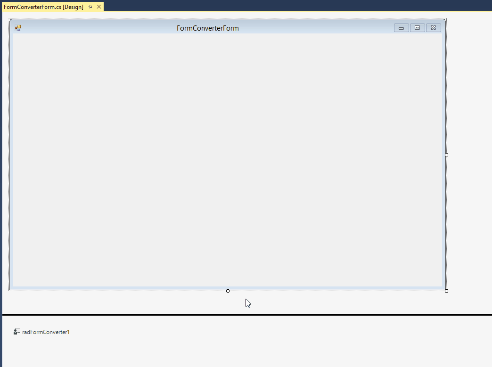

# Form Converter

**RadFormConverter** is a component which can be used in the designer of Visual Studio. It allows an easy conversion between **RadForm**, **RadRibbonForm**, and the standard **Form**.

>caption Figure 1: RadFormConverter

The actual conversion process is executed after selecting an item from the component`s action list. The available options are: 

* **Convert to Form**: Converts a **RadForm** or **RadRibbonForm** to the standard System.Windows.Forms.Form class. 
* **Convert to RadForm**: Converts a standard or ribbon form to a **RadForm**.
* **Convert to RadRibbonForm**: Converts a standard or **RadForm** to a **RadRibbonForm**.

>tip Any controls added in the Controls collection of the form will not be influenced by the conversion process.

# See Also 

* [RadForm]()
* [RadRibbonForm]()
 

