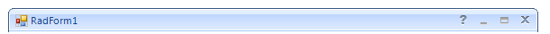

# Accessing RadForm Elements
 
The __RadForm__ is build of a __RadFormTitleBarElement__, __FormBorderPrimitive__ and a __FormImageBorderPrimitive.__ The following topic demonstrates how to access and modify these elements.

## Accessing the RadTitleBarElement

The __RadFormTitleBarElement__ is positioned on the top of the form and its default behavior is to display an icon, text, and the help, minimize, maximize/restore and close buttons. You can access the __RadFormTitleBarElement__ the following way:

#### Accessing RadForm elements 

{{source=..\SamplesCS\Forms and Dialogs\Form1.cs region=accessingRadFormElements}} 
{{source=..\SamplesVB\Forms and Dialogs\Form1.vb region=accessingRadFormElements}} 

````C#
void Form1_Shown(object sender, EventArgs e)
{
    this.FormElement.TitleBar.MaximizeButton.Enabled = false;
    this.FormElement.TitleBar.MinimizeButton.Enabled = false;
    this.FormElement.TitleBar.HelpButton.Visibility = Telerik.WinControls.ElementVisibility.Visible;
}

````
````VB.NET
Private Sub Form1_Shown(ByVal sender As Object, ByVal e As System.EventArgs) Handles Me.Shown
    Me.FormElement.TitleBar.MaximizeButton.Enabled = False
    Me.FormElement.TitleBar.MinimizeButton.Enabled = False
    Me.FormElement.TitleBar.HelpButton.Visibility = Telerik.WinControls.ElementVisibility.Visible
End Sub

````

{{endregion}} 

  



>note By default, the __HelpButton__ is not shown. It is necessary to set its __Visibility__ property to *ElementVisibility.Visible* in order to be displayed. The __HelpButtonClicked__ event is fired when Help button in the title bar is clicked. It can be canceled. However, if it is not canceled, the __HelpRequested__ event will be fired when the Help cursor is clicked on any Control. 


## Adding a new button to the title bar

You can easily extend the __RadFormTitleBarElement__ 's functionality by adding new elements to its hierarchy. The following code snippet demonstrated how to add a __RadButtonElement__ before the minimize button in the __RadFormTitleBarElement__:

#### Adding new button to the title bar 

{{source=..\SamplesCS\Forms and Dialogs\Form1.cs region=addingNewButtonToTheTitleBar}} 
{{source=..\SamplesVB\Forms and Dialogs\Form1.vb region=addingNewButtonToTheTitleBar}} 

````C#
void Form1_Load(object sender, EventArgs e)
{
    RadButtonElement buttonElement = new RadButtonElement();
    buttonElement.Text = "TitleBar Button";
    this.FormElement.TitleBar.Children[2].Children[0].Children.Insert(0, buttonElement);
}

````
````VB.NET
Private Sub Form1_Load(ByVal sender As Object, ByVal e As System.EventArgs) Handles Me.Load
    Dim buttonElement As New RadButtonElement()
    buttonElement.Text = "TitleBar Button"
    Me.FormElement.TitleBar.Children(2).Children(0).Children.Insert(0, buttonElement)
End Sub

````

{{endregion}} 
 

## Accessing the Form Borders

The border of a __RadForm__ control is composed of two border primitives which, together, define the visual appearance of the whole border: __FormBorderPrimitive__ and __FormImageBorderPrimitive__.

## Accessing the FormBorderPrimitive

The __FormBorderPrimitive__ represents the outer thin border that surrounds a __RadForm__ control. The following code snippet demonstrates how to modify the color of this primitive:

#### Accessing the FormBorderPrimitive 

{{source=..\SamplesCS\Forms and Dialogs\Form1.cs region=accessingTheFormBorderPrimitive}} 
{{source=..\SamplesVB\Forms and Dialogs\Form1.vb region=accessingTheFormBorderPrimitive}} 

````C#
this.FormElement.Border.ForeColor = System.Drawing.Color.Green;

````
````VB.NET
Me.FormElement.Border.ForeColor = System.Drawing.Color.Green

````

{{endregion}} 


>note The visual appearance of the border and also for the whole RadForm control can be designed in the Visual Style Builder.
>


## Accessing the FormImageBorderPrimitive

The __FormImageBorderPrimitive__ represents the inner thick border that starts from the bottom-left corner of the title bar, surrounds the __RadForm__ control and ends at the bottom-right corner of the title bar. The __FormImageBorderPrimitive__ provides you with the possibility to define borders for your form which are built of images and thus achieve better look-and-feel for your form. Without images set, the __FormImageBorderPrimitive__ paints as a one-color-border with the color set to the __BackColor__ property of the primitive. 

The following code snippet demonstrates how to set the __BackColor__ of the __FormImageBorderPrimitive__ which is painted when no images are defined:

#### Accessing the FormImageBorderPrimitive 

{{source=..\SamplesCS\Forms and Dialogs\Form1.cs region=accessingTheFormImageBorderPrimitive}} 
{{source=..\SamplesVB\Forms and Dialogs\Form1.vb region=accessingTheFormImageBorderPrimitive}} 

````C#
this.FormElement.ImageBorder.BackColor = Color.Lime;

````
````VB.NET
Me.FormElement.ImageBorder.BackColor = Color.Lime

````

{{endregion}} 

 
>note More information on how to use the __FormImageBorderPrimitive__ can be found in the separate topic: [Using the FormImageBorderPrimitive]().
>


