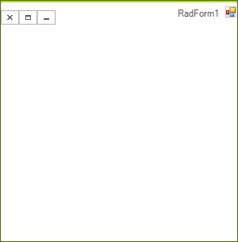

# Right-To-Left Support

## 

RadForm carries forward standard Windows Form class functionality, including full support for right-to-left cultures. By default your RadForm layout will be left-to-right. In the screenshot below, however, the RightToLeft property of the __RadForm__control is set to *Yes *and the form's title bar are drawn from right to left:

