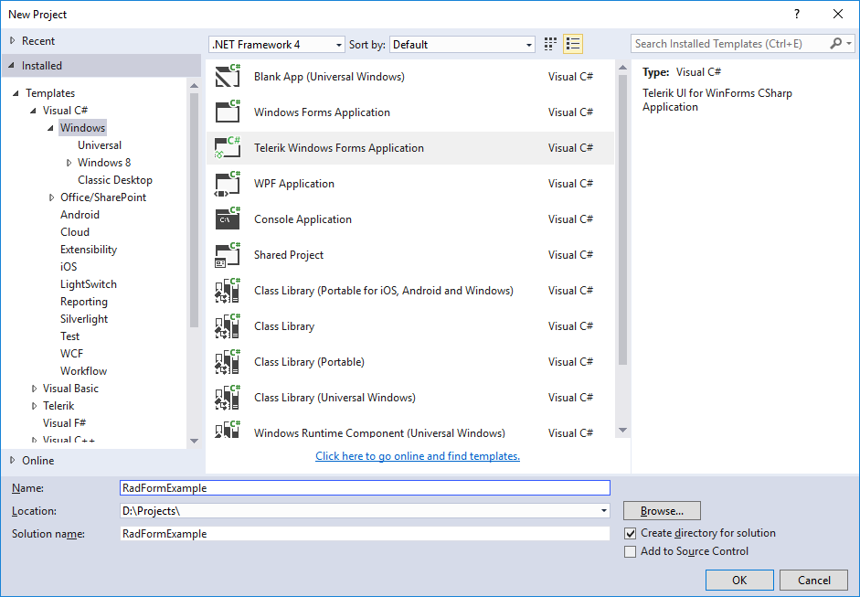
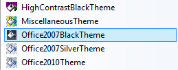
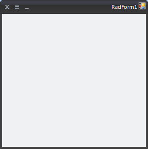

# Themes

RadForm comes with a number of themes which can be easily applied by setting the ThemeName property.
        This topic demonstrates how to apply predefined themes.
      

## Applying Themes to RadForm

The themes allow you to modify the look-and-feel of a __RadForm__ instance by simply setting
          the __ThemeName__ property.
        

This section shows how to apply the Office2007Black theme to a __RadForm__ in the Visual Studio designer:
        

1. Add a __RadForm__ item in your project or change the base class of an existing standard Windows Form to __Telerik.WinControls.UI.RadForm.__

#### __[C#] Changing WinForms form to Telerik RadForm__

{{region radForm}}
	    partial class Form1 : Telerik.WinControls.UI.RadForm
	{{endregion}}

#### __[VB.NET] Changing WinForms form to Telerik RadForm__

{{region radForm}}
	Partial Class Form1
	    Inherits Telerik.WinControls.UI.RadForm
	{{endregion}}

1. Open the __Design View__ of the Form and open the Visual Studio Toolbox.
            

1. In the Visual Studio Toolbox find the __Office2007BlackTheme__component.
            

1. Drag and drop the component onto your __RadForm.__

1. Open the Properties Window for the form and find the __ThemeName__ property.
            

1. In order to apply the Office2007Black theme to RadForm, choose the *'Office2007Black'* option from the ThemeName drop-down:
            

>tipYou do not need to add multiple Theme Components on each form which you would like to customize. By adding one Theme Component on a form, the theme is loaded in the memory and it becomes available for all __RadControls__ and __RadForms__ in your project.
          
