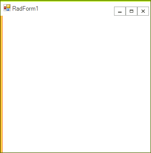
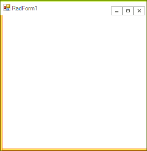
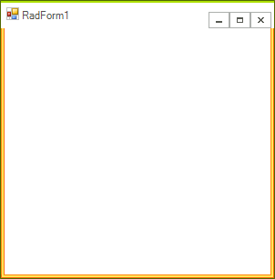

# Using the FormImageBorderPrimitive

 
The __FormImageBorderPrimitive__ allows you to customize the appearance of your __RadForm__ by creating custom borders built of images. In this way you can easily create stylish visual effects and professional look-and-feel for your __RadForm__ control.

The following topic describes how the __FormImageBorderPrimitive__ works and demonstrates how to create a form with image borders.

## Utilizing the FormImageBorderPrimitive

The __FormImageBorderPrimitive__ exposes the following properties which are used to define the separate images which build the border:

* TopLeftEnd

* LeftTexture

* BottomLeftCorner

* BottomTexture

* BottomRightCorner

* RightTexture

* TopRightEnd

The following picture shows the positions at which the images appear:

The __LeftTexture__, __BottomTexture__ and __RightTexture__ are drawn as textures between the __TopLeftEnd__ and __BottomLeftCorner__, __BottomLeftCorner__ and __BottomRightCorner__, __BottomRightCorner__ and __TopRightEnd__ respectively. The __TopLeftEnd__ and the __TopRightEnd__ images are used to define a smooth transition between the image border and the __RadFormTitleBarElement__. The __BottomLeftCorner__ and __BottomRightCorner__ properties are used to set the images which are drawn in the corners of the form's border.

It is important to know that setting one of the following properties does not cause any parts of the __FormImageBorderPrimitive__to be drawn:

* TopLeftEnd

* BottomRightCorner

* BottomLeftCorner

* TopRightEnd

The minimum requirement for parts of the border to be drawn is setting one of the following properties:

* LeftTexture

* BottomTexture

* RightTexture

Here is how the __RadForm__ control looks when the __LeftTexture__ property is set with the following image:

After setting the __BottomTexture__ property with the following image:

The __RightTexture__ property with the following image:

The __BottomLeftCorner__ and __BottomRightCorner__ properties with the corresponding images:

The parts used to build the Image Border of the form are scaled for the purpose of the topic.

The __TopLeftEnd__ and __TopRightEnd__ images are not obligatory as well as the __BottomLeftCorner__ and __BottomRightCorner__ images. However, they are needed for creating a more complete image border design for your __RadForm__ control.You can set images for the FormImageBorderPrimitive in the Visual Style Builder as a part of a theme for the __RadForm__ control.
