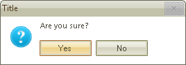

# Getting Started

## 

The following tutorial will show you a simple usage of RadMessageBox

1. Create a new Windows Application in Visual Studio

1. Drag and drop a RadButton on the form.

1. Subscribe to the Click event of this RadButton.

1. 
          	Make sure that you import/use the following namespaces
          	 

#### __[C#] Adding namespace__

{{source=..\SamplesCS\Forms and Dialogs\MessageBox1.cs region=namespace}}
	using Telerik.WinControls;
	{{endregion}}

#### __[VB.NET] Adding namespace__

{{source=..\SamplesVB\Forms and Dialogs\MessageBox1.vb region=namespace}}
	Imports Telerik.WinControls
	{{endregion}}

1. In the RadButton.Click event handler, first set the theme of the
				    RadMessageBox and then call its static Show method of the RadMessageBox
				    class, passing the appropriate parameters. Set the RadMessageBox.Show
				    method to a DialogResult variable: 
      		

#### __[C#] Setting a theme and showing RadMessageBox__

{{source=..\SamplesCS\Forms and Dialogs\MessageBox1.cs region=workingWithRadMessageBox}}
	        private void radButton1_Click(object sender, EventArgs e)
	        {
	            RadMessageBox.SetThemeName("Desert");
	            
	            DialogResult ds = RadMessageBox.Show(this, "Are you sure?", "Title", MessageBoxButtons.YesNo, RadMessageIcon.Question);
	            this.Text = ds.ToString();
	        }
	{{endregion}}

#### __[VB.NET] Setting a theme and showing RadMessageBox__

{{source=..\SamplesVB\Forms and Dialogs\MessageBox1.vb region=workingWithRadMessageBox}}
	    Private Sub RadButton1_Click(ByVal sender As System.Object, ByVal e As System.EventArgs) Handles RadButton1.Click
	        RadMessageBox.SetThemeName("Desert")
	
	        Dim ds As DialogResult = RadMessageBox.Show(Me, "Are you sure?", "Title", MessageBoxButtons.YesNo, RadMessageIcon.Question)
	        Me.Text = ds.ToString()
	    End Sub
	{{endregion}}

1. The result RadMessageBox is shown below:
    

