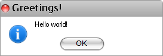

# MessageBox

## 

RadMessageBox displays a modal dialog box that contains a system icon, a set of buttons, and a brief application-specific message, such as status or error information.  You cannot create a new instance of the MessageBox class. To display a message box, call the static method RadMessageBox.Show. The title, message, buttons, and icons displayed in the message box are determined by parameters that you pass to this method. 

