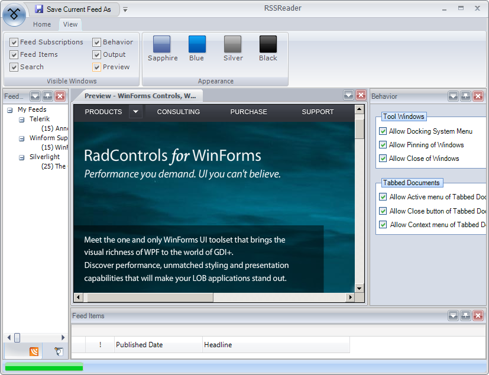
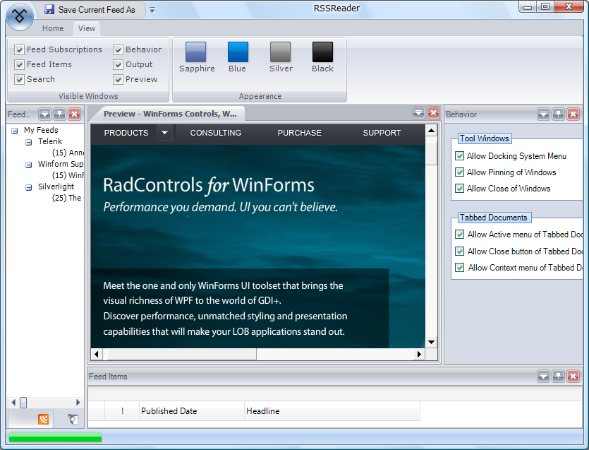

# RibbonForm

## 

The __RadRibbonForm__ control is designed to host a __RadRibbonBar__ control and mimic the Microsoft Office 2007 UI form style. This control automatically detects whether it runs under Windows Vista and Desktop Window Manager Effects are enabled and adjusts itself to make use of these effects just as Microsoft Office 2007 applications do.

The following screenshots show the RadRibbonForm control in action:

