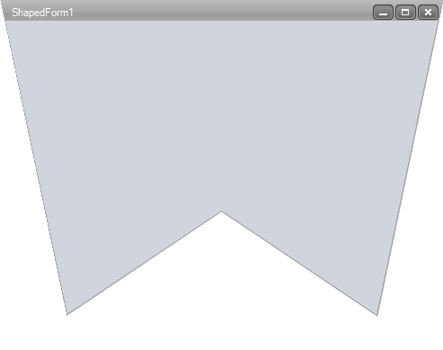

# ShapedForm

## 

The __ShapedForm__ control allows you to design and display a Windows 
        	form with any conceivable shape. You can couple this control with the 
        	[RadTitleBar control]()
        	 to easily add forms with a completely custom look and feel to your applications.
        
