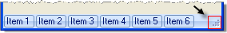

# RadStatusBar Properties

Significant properties particular to __RadStatusBar__ are: 

## LayoutStyle

The __LayoutStyle__ property handles the arrangement of items when they exceed the horizontal space in the status bar. 

__Stack__ (the default) arranges items from left to right and the rightmost items that exceed the horizontal space are not visible. 

__Overflow__ moves items in excess of the horizontal space to the following line.

## GripStyle

By default the grip is __Hidden__. The image below shows __GripStyle__ set to __Visible.__

