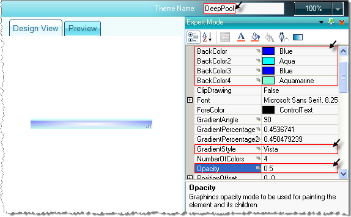

# Styling

## 

The following tutorial demonstrates creating a custom theme for the __RadStatusStrip__. An example of this theme is shown in the screenshot below.  Note in the screenshot "My ButtonElement" has the __BackColor__ property set to __Transparent__ so that the status bar colors show through.

1. Add any number and types of elements to a RadStatusStrip.Also from the __Smart Tag__ and select __Open Theme Builder__ to start __Visual Style Builder__.

1. In the __Design View__ tab use the crosshair mouse cursor to select the fill area of the status bar.  Note: when selected, the __Control Structure__ tab will show the __FillPrimitive__ selected.
         
          

1. Set the __Theme Name__ to "DeepPool".

1. In the __Expert Mode__ pane set the __BackColor__ properties to __Blue__, __Aqua__, __Blue__ and __Aquamarine__, respectively. Set the __GradientStyle__ to __Vista__ and the __Opacity__ to .5.
          

1. From the __File__ menu select __Save Theme As__. Save the file as "DeepPool.xml". Note the file location for later reference.

1. Choose __Exit__ from the file menu to close __Visual Style Builder__.

1. Drop a __RadThemeManager__ from the __Toolbox__ to the form.

1. From the __RadThemeManager Smart Tag__ select __Load Theme From File__. Load the previously saved "DeepPool.xml" file.

1. In the __RadStatusStrip Smart Tag__ select the "DeepPool" style.
