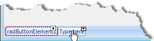
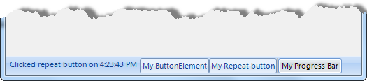

# Working With RadStatusStrip Items

 
## Item Element Types

The following element types can be added to the RadStatusStrip Items collection:

* RadButtonElement

* RadToggleButtonElement

* RadRepeatButtonElement

* RadCheckBoxElement

* RadImageButtonElement

* RadLabelElement

* RadProgressBarElement

* RadStatusStripPanelElement

* CommandBarSeparator

## Adding Items At Design-Time

There are several alternatives for adding and editing the __RadStatusStrip Items__ collection in the designer:

* Click on the "Type here" label and edit directly. When you're done, click __Enter__ to save your changes. Click __Esc__ to abandon changes.



* Open the __Smart Tag__ and select __Edit Items__ to open the __Rad Items Collection Editor__.

* From the Properties Editor select the __Items__ property ellipses to open the __Rad Items Collection Editor__.

## Adding Items At Run-Time

Add items at runtime by creating __RadElement__ instances and adding them to the __RadStatusStrip__ Items collection. The example below demonstrates creating and adding __RadLabelElement__, __RadButtonElement__, __RadRepeatButtonElement__, __RadToolBarSeparatorElement__ and __RadProgressBarElement__.



#### Adding elements to RadStatusStrip 

{{source=..\SamplesCS\Forms and Dialogs\StatusStrip1.cs region=addingElementsToRadStatusStrip}} 
{{source=..\SamplesVB\Forms and Dialogs\StatusStrip1.vb region=addingElementsToRadStatusStrip}} 

````C#
private void StatusStrip1_Load(object sender, EventArgs e)
{
    RadLabelElement labelElement = new RadLabelElement();
    labelElement.Text = "My LabelElement";
    RadButtonElement buttonElement = new RadButtonElement();
    buttonElement.Text = "My ButtonElement";
    buttonElement.Click += new EventHandler(buttonElement_Click);
    RadRepeatButtonElement repeatButtonElement = new RadRepeatButtonElement();
    repeatButtonElement.Text = "My Repeat button";
    repeatButtonElement.Click += new EventHandler(repeatButtonElement_Click);
    CommandBarSeparator separator = new CommandBarSeparator();
    RadProgressBarElement progressBarElement = new RadProgressBarElement();
    progressBarElement.Text = "My Progress Bar";
    radStatusStrip1.Items.AddRange(new RadItem[] {labelElement, buttonElement, repeatButtonElement, separator, progressBarElement}); 
}
void repeatButtonElement_Click(object sender, EventArgs e)
{
    (radStatusStrip1.Items[0] as RadLabelElement).Text = "Clicked repeat button on " + DateTime.Now.ToLongTimeString();
}
void buttonElement_Click(object sender, EventArgs e)
{
    MessageBox.Show("Clicked on ButtonElement");
}

````
````VB.NET
Private Sub Form1_Load(ByVal sender As System.Object, ByVal e As System.EventArgs) Handles MyBase.Load
    Dim labelElement As New RadLabelElement()
    labelElement.Text = "My LabelElement"
    Dim buttonElement As New RadButtonElement()
    buttonElement.Text = "My ButtonElement"
    AddHandler buttonElement.Click, AddressOf buttonElement_Click
    Dim repeatButtonElement As New RadRepeatButtonElement()
    repeatButtonElement.Text = "My Repeat button"
    AddHandler repeatButtonElement.Click, AddressOf repeatButtonElement_Click
    Dim separator As New CommandBarSeparator()
    Dim progressBarElement As New RadProgressBarElement()
    progressBarElement.Text = "My Progress Bar"
    RadStatusStrip1.Items.AddRange(New RadItem() {labelElement, buttonElement, repeatButtonElement, separator, progressBarElement})
End Sub
Sub repeatButtonElement_Click(ByVal sender As Object, ByVal e As EventArgs)
    TryCast(RadStatusStrip1.Items(0), RadLabelElement).Text = "Clicked repeat button on " + DateTime.Now.ToLongTimeString()
End Sub
Sub buttonElement_Click(ByVal sender As Object, ByVal e As EventArgs)
    MessageBox.Show("Clicked on ButtonElement")
End Sub

````

{{endregion}} 


