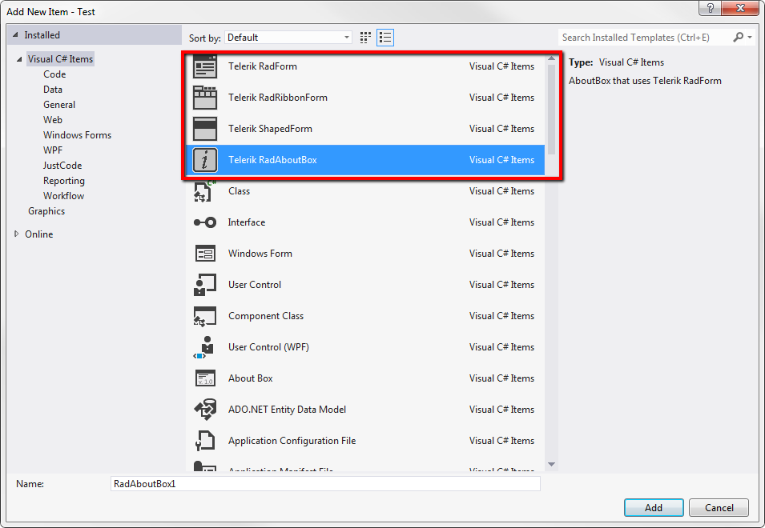

# Templates

## 

The Visual Studio templates that install with Telerik UI for WinForms let you add 
          [RadForm]() 
          and [ShapedForm]()
          to your application without any coding steps. There are also two other specialized forms, __RadRibbonForm__that
          contains a built-in RadRibbonBar and __RadAboutBox__that is an enhanced, themeable version of the regular
          AboutBox.
        
