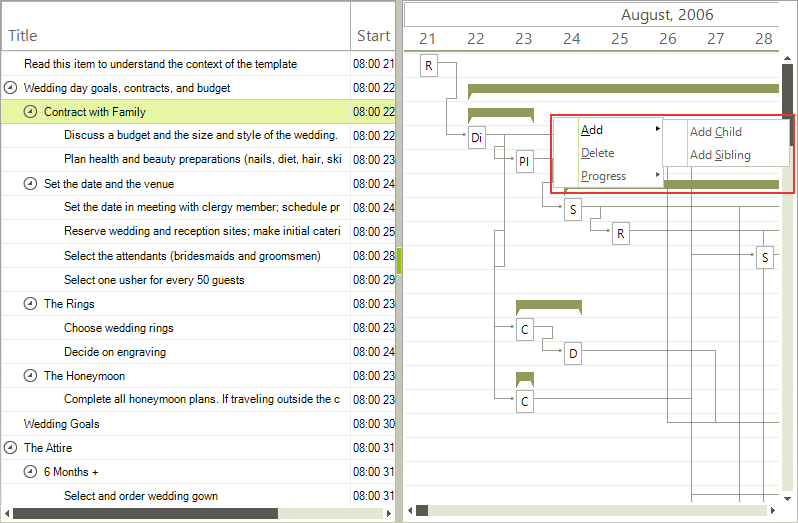
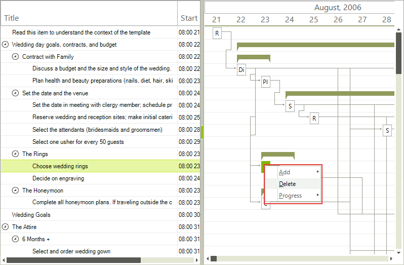
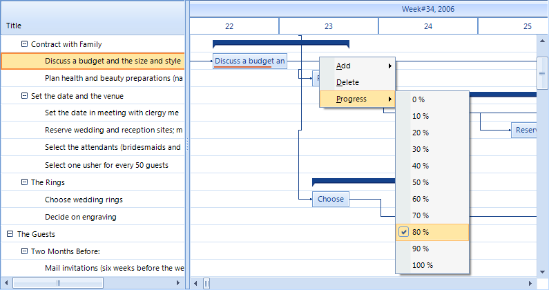

# Default context menu

RadGanttView has a default context menu which allows several operations with the gantt data items to be performed.
      

## 
        Add
      

The Add option offers two ways to add an item. You can add an item on the same level as the item you clicked on or you can add a new 
          child to the item you clicked on.
        

Adding a child will add it at the last position in the parent task Items collection.
        

Adding a sibling will add it before the item you clicked on.
        

## Delete
      

The Delete option does exactly what you would expect it to. It deletes the item you have clicked on.
          It also removes any child items from the gantt view.
        

## 
        Progress
      

The Progress option allows you to set the progress of a task to a certain value. You can modify the step at which the progress menu items increase and thus their number through the ProgressStep property of the context menu. Also you can control whether this option should appear at all through the ShowProgress property. If the item current progress is not a multiple of the progress step the value is automatically added in the appropriate position of the menu items.
        
